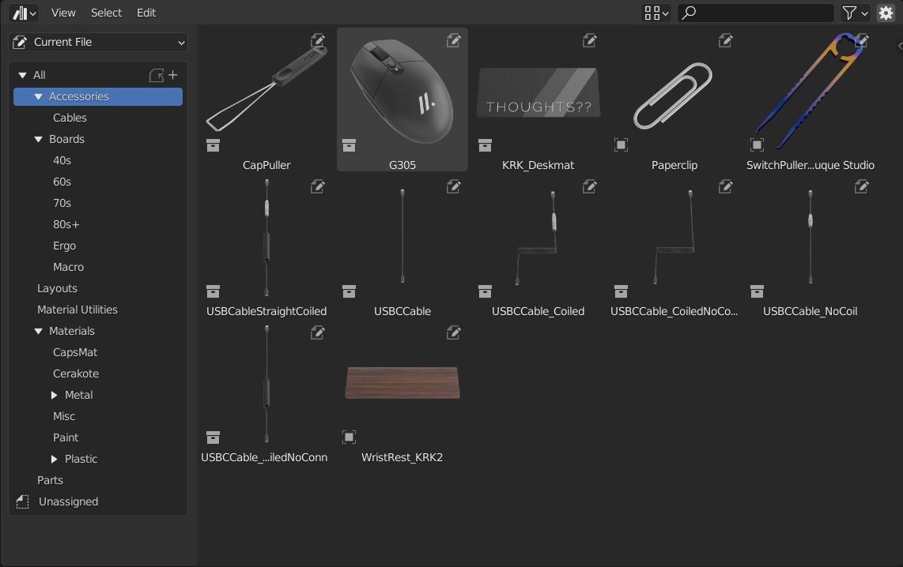
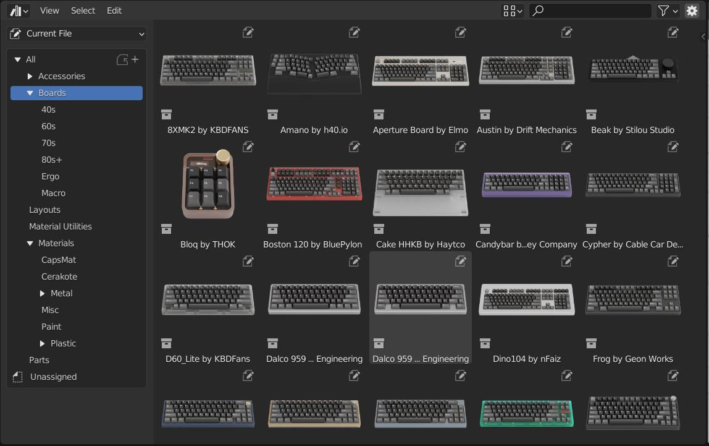
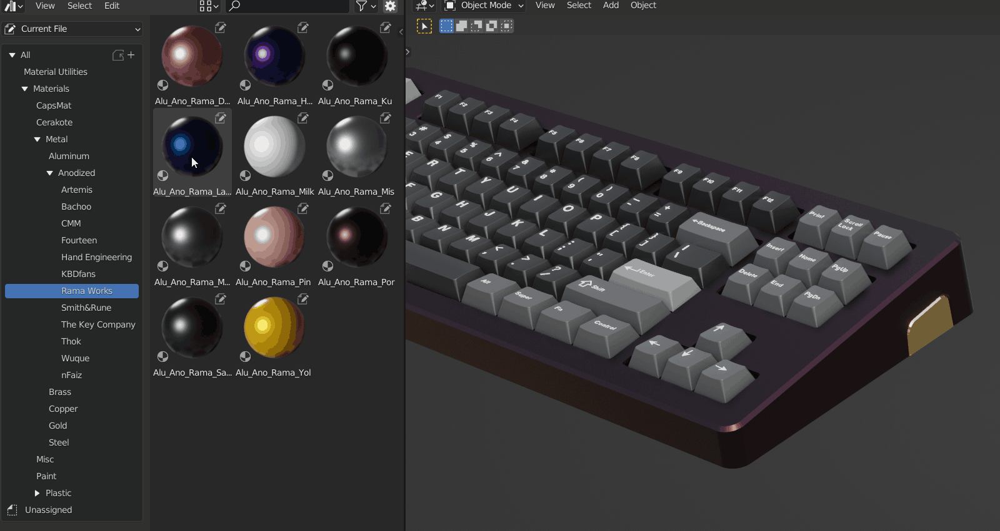
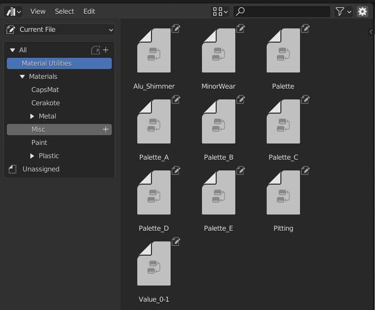

Asset Browser
====
Accessory Assets
~~~~
Accessories can be found in the Accessory section.

Boards Assets
~~~~
Keyboard models can be found in the the Boards section.

Material Assets
~~~~
The asset browser is preloaded with several useful materials categorized by type and manufacturer. You can drag and drop these onto your objects in the 3d viewport.

|

Material Utilities
~~~~

The material utilities can be dragged into the material editor to add effecs when you are building your own materials.

|
