Custom Board
====

This tutorial isn't going to cover export settings from your CAD software. Export your design as an OBJ or FBX and import it into Blender. Alternately, you can use the Stepper Blender addon to import the STEP/STP file directly.

|

As an example, let's use Alchemist Keyboards Aella render file converted to OBJ. `Right Click > Save <https://github.com/imperfectlink/KeyboardRenderKit/raw/main/docs/source/files/AKB_Aella.obj>`_

|

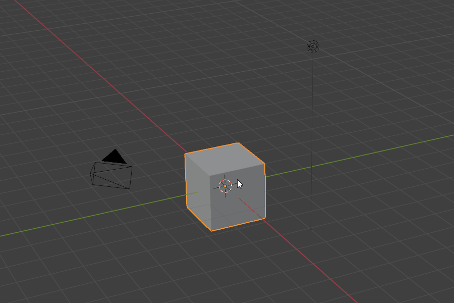

In a new Blender file, delete the contents (cube, camera, light) (A X D) and set your Units to millimeters in the Scene Properties tab of the Properties Panel.

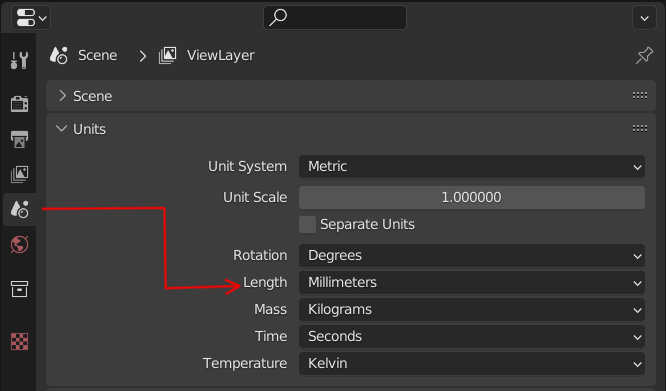

|

Now you can import the Aella OBJ by clicking File > Import > Wavefront Obj (F4 I W)

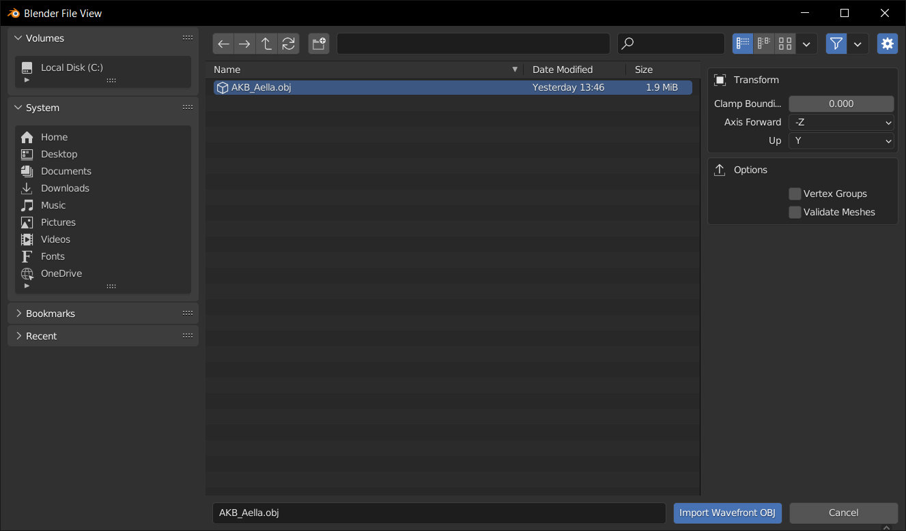

|

The first thing you'll notice is that the scale is incorrect. In this case the millimeter units were plugged into meters. 

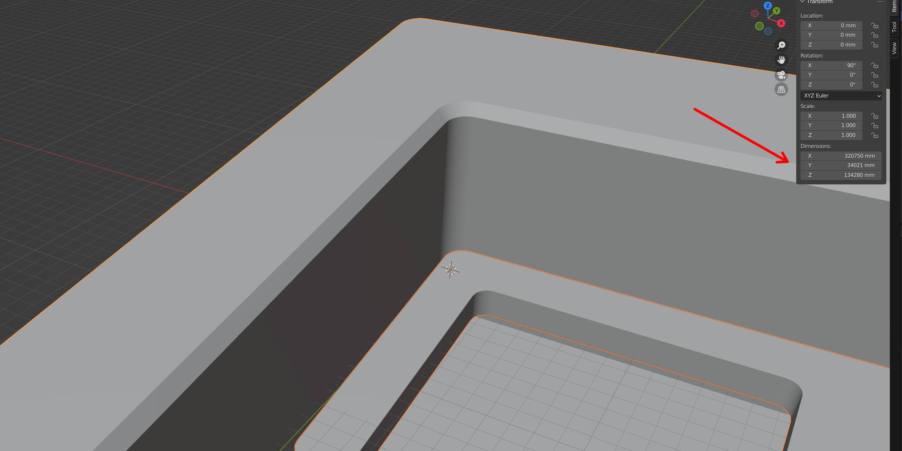

|

Scale the board to a thousandth by pressing S 0.001 . You may have to reframe your board so you can see it using the Home key.

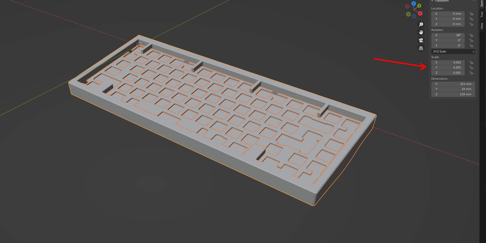

|

Now apply the scale and rotation by pressing ctrl+A then A again to apply All Transforms.

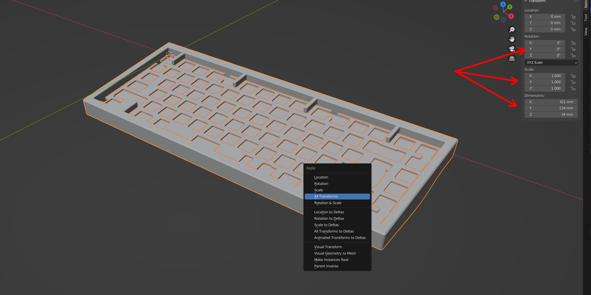

|

Now let's create a move handle. Press Add > Mesh > Plane (Shift+A M P)

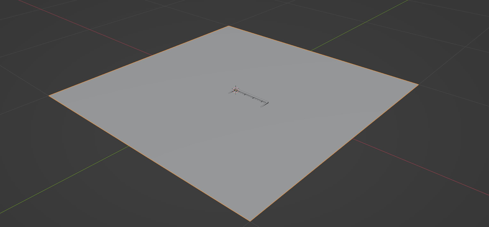

|

Hold Shift and click on the board's bottom case to add it to the selection. Then align the plane using Object > Transform > Align Objects and enable X and Y axes by shift clicking both X and Y in the dialogue.

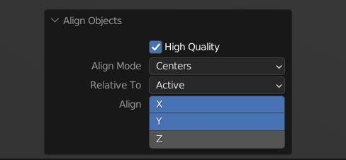

|

Now repeat the Align Objects, this time with Align Mode set to Negative Sides and the Z axis selected.

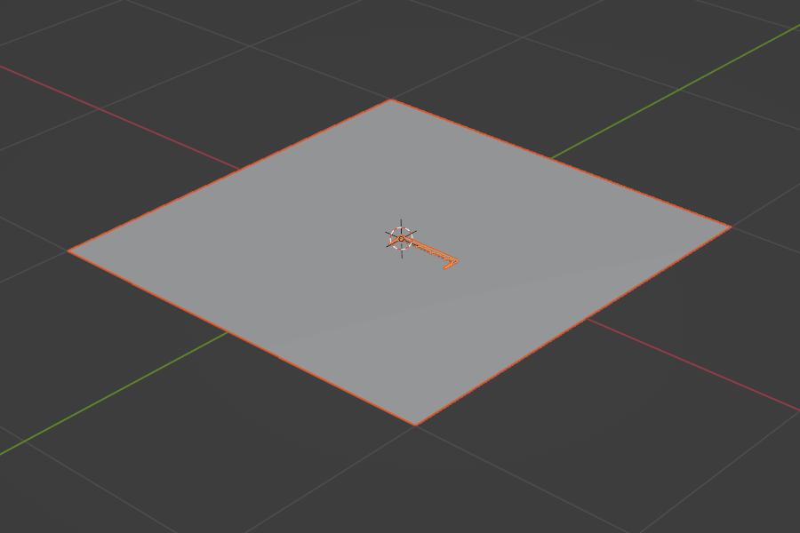

|

Your plane is now in the right position, next it needs to be scaled to be a little larger than the board footprint (S X + S Y) then apply the scale.

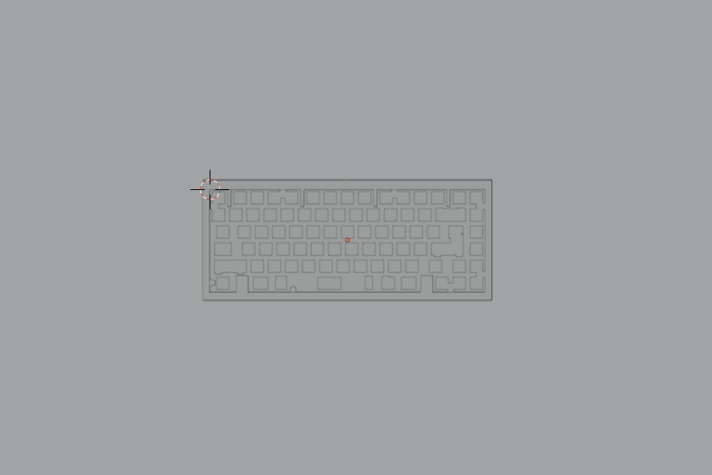

|

Convert it into a curve using Object > Convert > Curve. Your move handle is done.

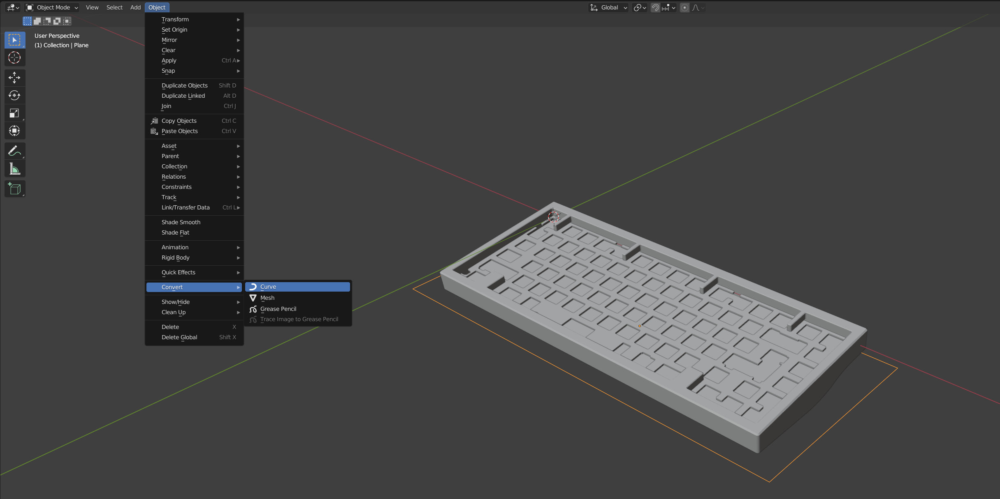

|

Parent all of the board objects to the move handle. With it selected, press A to select all then ctrl+P > Object (Keep Transform). Now when you move the move handle, the rest will come with it. Clear the location with Alt+G to reset the move handle and all of its children to world 0.

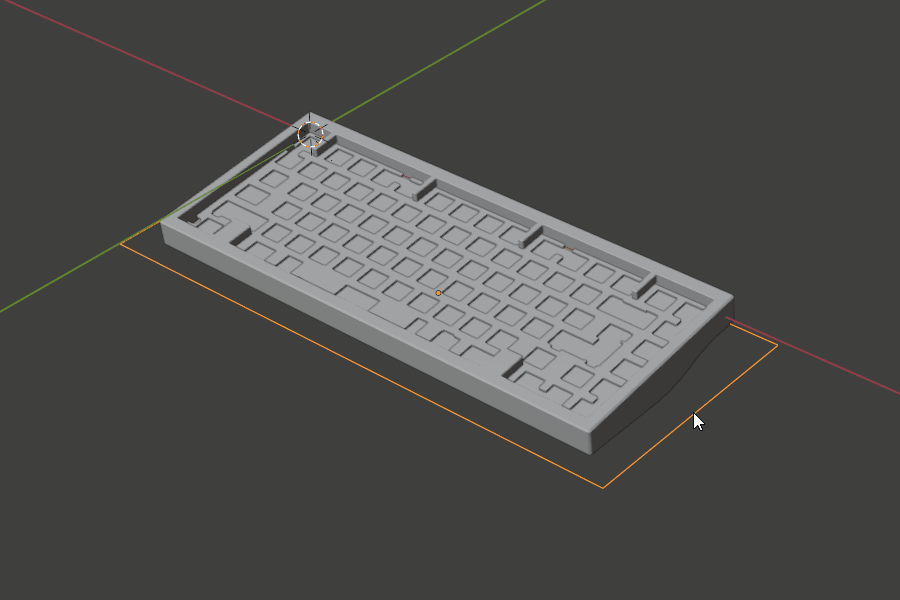

|

Now it's time to import the keycap layout. In this case it's the 75% layout. File > Append then navigate to the KRK201 file and double click on it. Blend files behave like folders. Now enter the Collections, search for 75 and append the 75 collection. 

.. image:: mig/ImportLayout.jpg

|

You may have to enable the viewport visibility for the collection. In the outliner, enable viewport disable filter and enable it for the 75 collection.

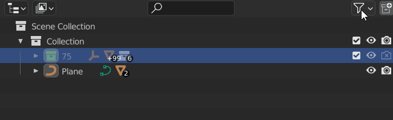

|

Select the layout's move handle (cross shaped empty) and move the layout into position based on the Alphas section and rotate it 7 degrees on the X axis (type angle for Aella).

|

Parent the layout's move handle to the board's move handle.

|

The placeholders will need to be moved around to match the board's layout. You can set the increment amount to 1/8th unit by entering this number into the grid size.

|

