USB Cables
====
There are a few configurations of USB cable available.

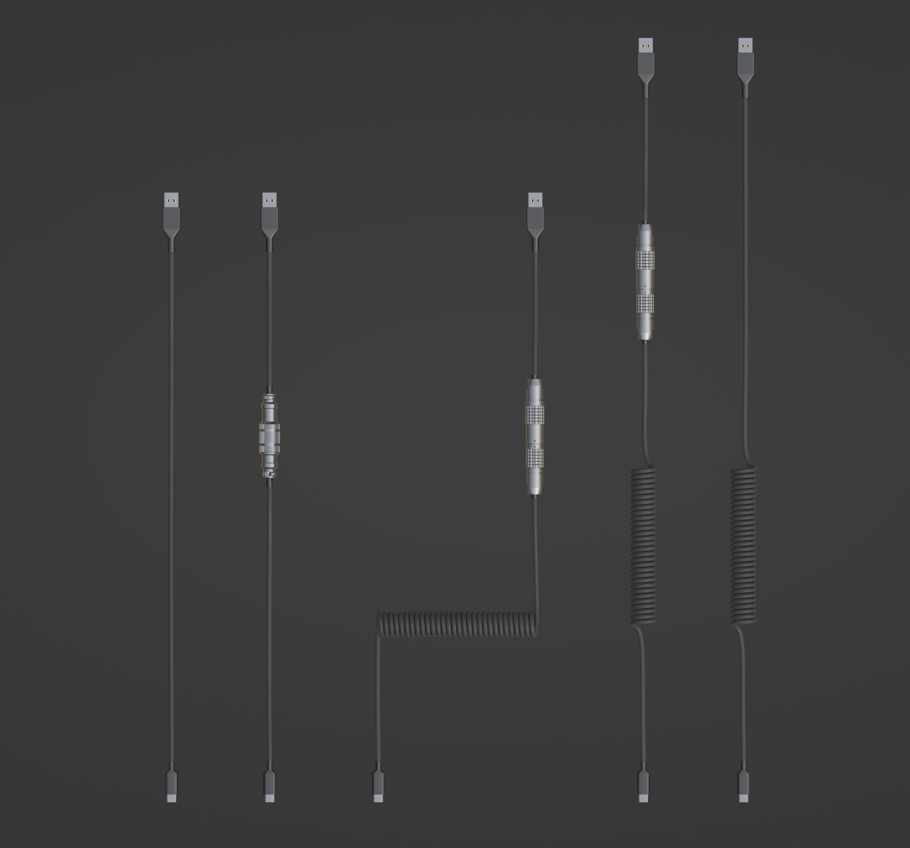

|

Use the handles to pose the cable as you wish.

.. image:: img/CableHandle.gif

|

USB heads are interchangeable with other types through object data.

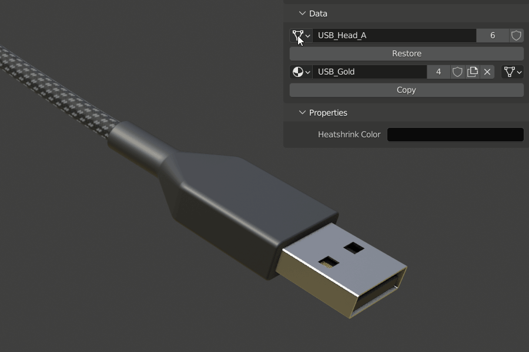

|

Aviator and Lemo are interchangeable and can unplug.

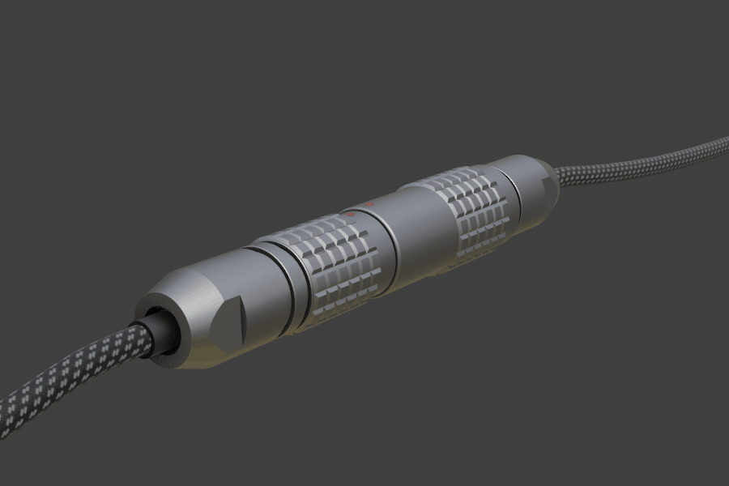

|

Settings
~~~~
Settings are separate per object and per segment of cable.

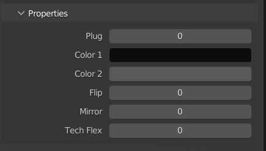

|

Plug
----
This setting plugs the Lemo or Aviator back together.

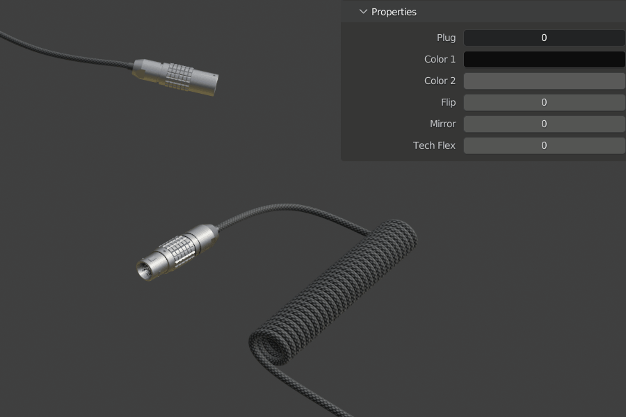

|

Color
----
Colors 1 and 2 supplies the material with color and accent color.

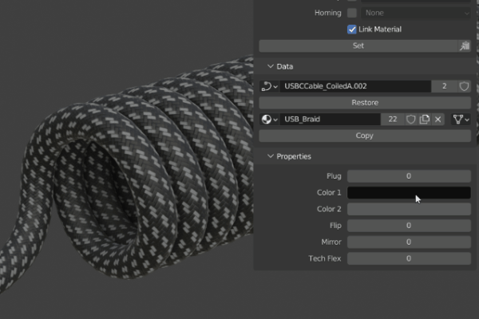

|

Flip
----
This setting flips the coil vertically.

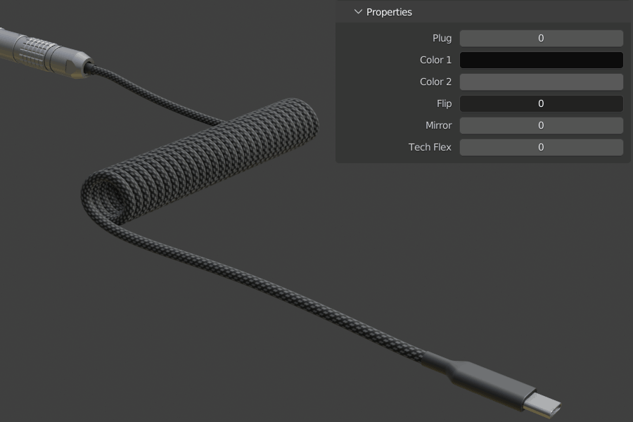

|

Mirror
----
This setting mirrors the cable horizontally.

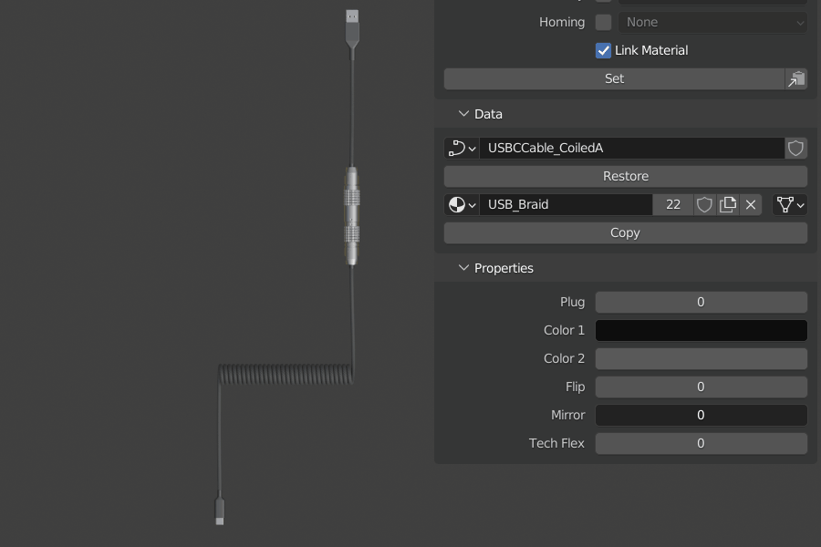

Tech Flex
----
This setting changes the cable over from a braid to Tech Flex.

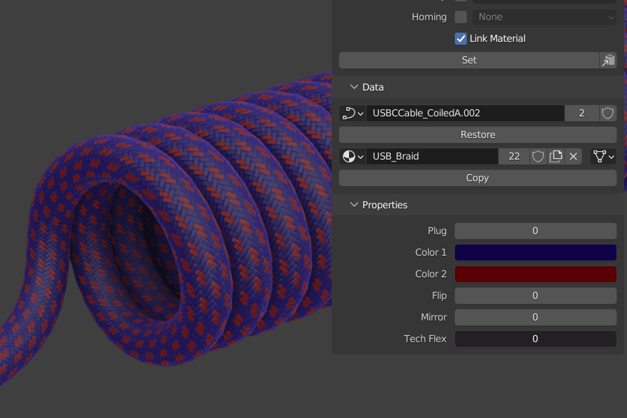

|

Straight Cable
~~~~
The plain USB cable is an exception in that it is designed to infinitely extend through editing the curve object and adding vertices by subdividing the segments.

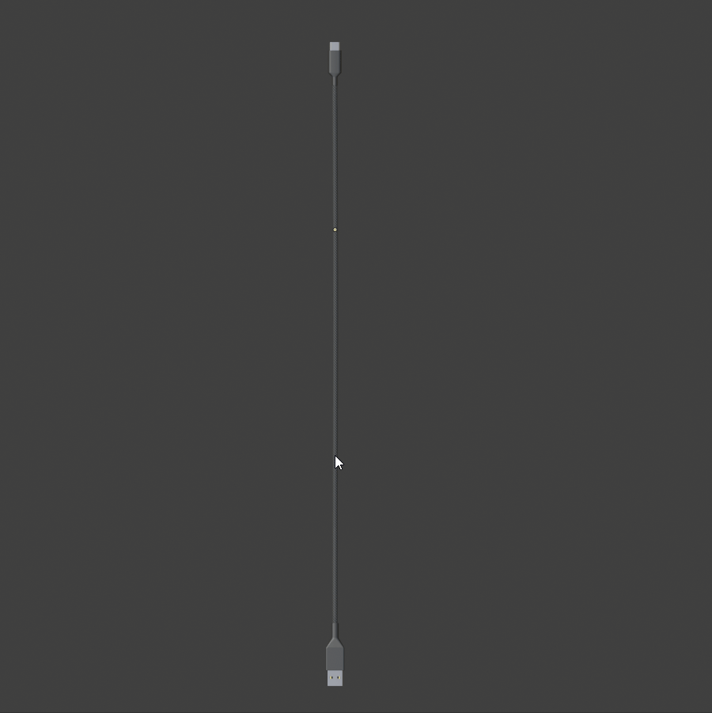

|

Material
~~~~

As with the deskmat, to change the material you will need to edit the applied materials or replace them via the modifiers section of the object's properties. 

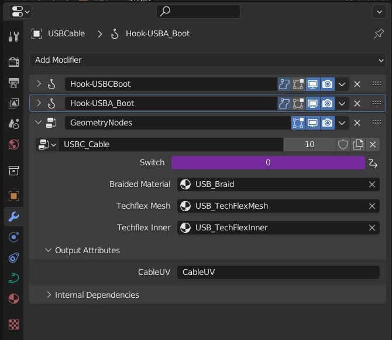

|

.. _Exporting Cables:

Exporting Cables
~~~~

Reference `Exporting Cables`_.

If you are exporting the cable to another software, the cable will not have a UV map and will need to be converted from an attribute. Select the cable (wire) object and press ctrl+A then choose Visual Geometry to Mesh.

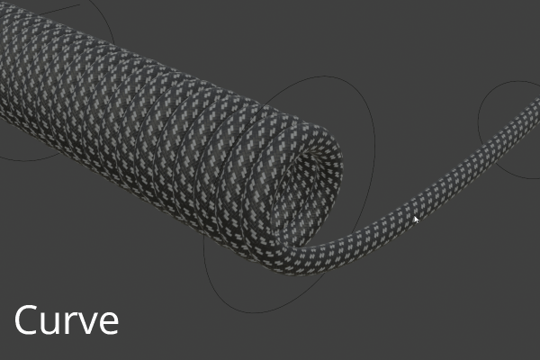

|

Once that is done, there will be an attribute in the object's data that can be converted to a UV map by using the dropdown in Attributes in Object Data Properties. Set the mode to UV Map and press okay.

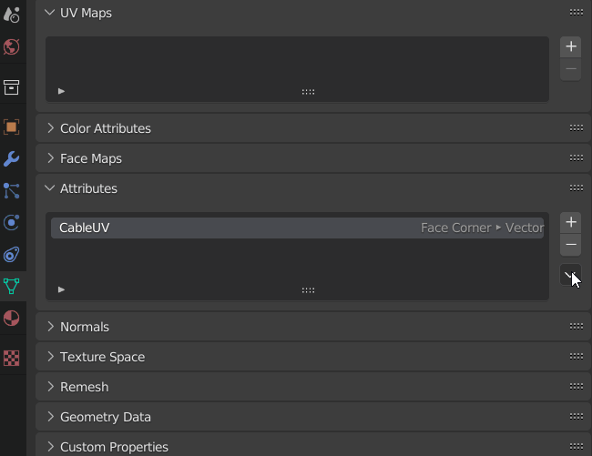

|

Your cable is now ready for export.
