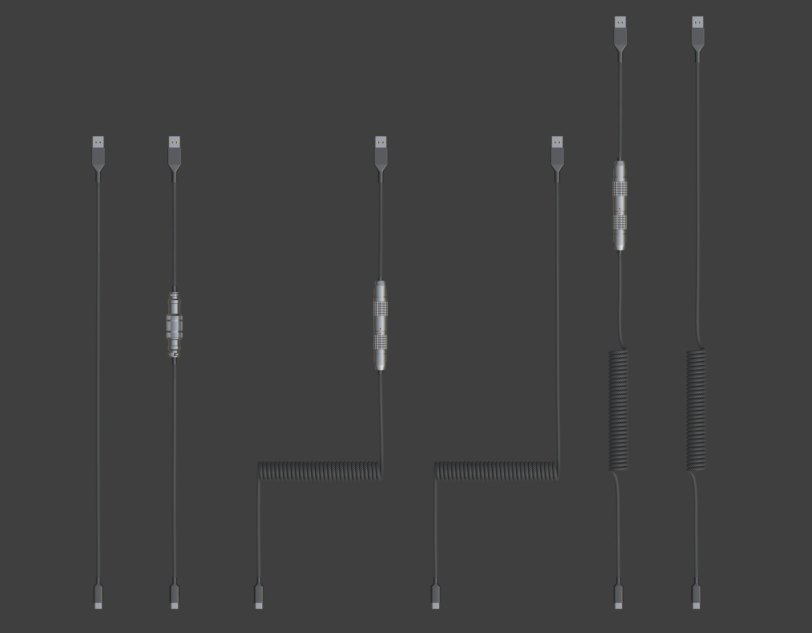
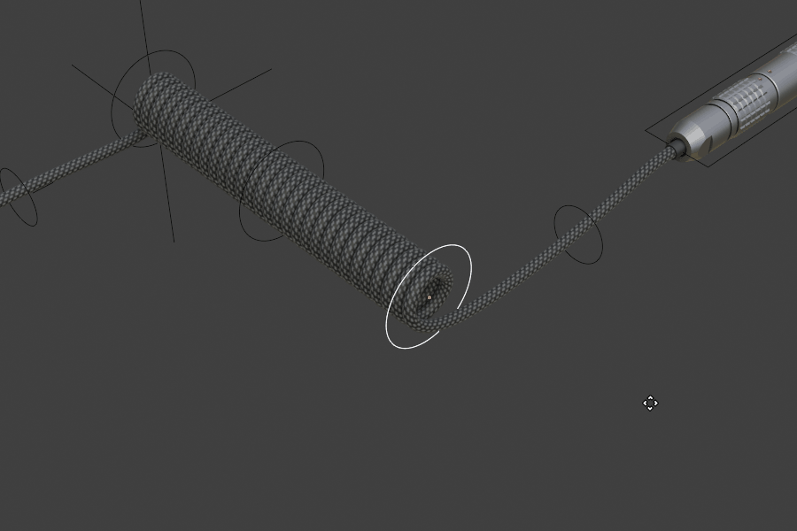

USB Cables
====
There are a few configurations of USB cable available.

Use the handles to pose the cable as you wish.

USB heads are interchangeable with other types through object data.

Aviator and Lemo are interchangeable and can unplug.

|

Settings
~~~~
Settings are separate per object and per segment of cable.

.. image:: img/CableProps.JPG

Plug
----
This setting plugs the Lemo or Aviator back together.

Color
----
Colors 1 and 2 supplies the material with color and accent color.

Flip
----
This setting flips the coil vertically.

Mirror
----
This setting mirrors the cable horizontally.

Tech Flex
----
This setting changes the cable over from a braid to Tech Flex.

|

Straight Cable
~~~~
The plain USB cable is an exception in that it is designed to infinitely extend through editing the curve object and adding vertices by subdividing the segments.

|

Material
~~~~

As with the deskmat, to change the material you will need to edit the applied materials or replace them via the modifiers section of the object's properties. 

|
