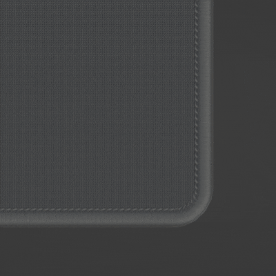

Deskmat
====
The deskmat model is built procedurally with procedurally generated edge stitching.

|

Dimensions
~~~~

It has custom controls in the KRK panel and supports dimensions up to 1m x 1m, corner fillets up to 500mm and a thickness up to 1cm.

|

Edging
~~~~

This option turns off edge stitching altogether.

Edge Print
~~~~

Use this option to turn off the edge print and use a solid color for the edging.

|

Edge Color
~~~~

This is where you set the color for the edging when it is a solid color.

|

Material
~~~~

In order to change the material, you will need to edit the materials that are applied which you can select in the Material Properties and edit in the Shader Editor.

.. image:: img/DeskmatMats.gif

You can replace the applied material and select another material in the modifiers section of the object's properties.

|

Exporting
~~~~

If you are exporting the deskmat to other software, the stitching for the deskmat needs to be converted and the UV attribute converted to a UV map. See the export section of the USB Cables page to learn this process.

:ref: `USB Cables <cables/Exporting>`_

|

