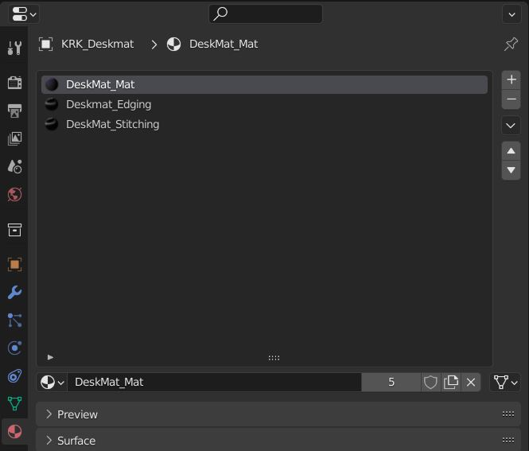
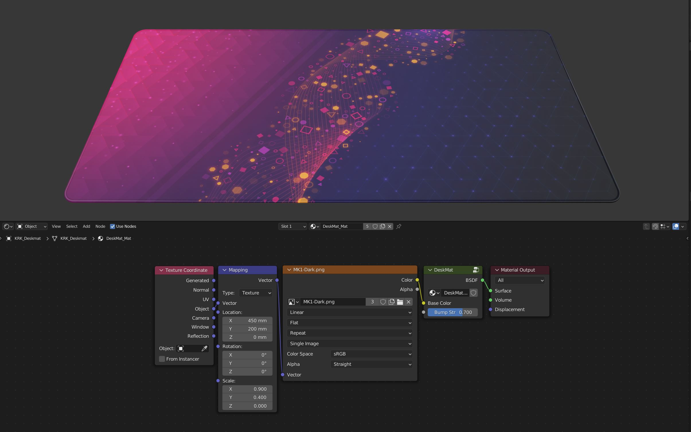

Adding Your Own Deskmat Design
====

You can add your own deskmat design to the deskmat by editing three materials, Deskmat_Mat, Deskmat_Edging and Deskmat_Stitching. You can find these in the Material Properties panel.

|

Find the image texture node in each of the materials and load your own image into the node.

|

By default, the deskmat is able to scale to 1mx1m so your design should be positioned on a 1mx1m square.

|

If you prefer to use another size image, make sure to set the position in the mapping node to half the deskmat size and the scale to the size in meters.

|

You can also replace the image texture node with a pattern.
