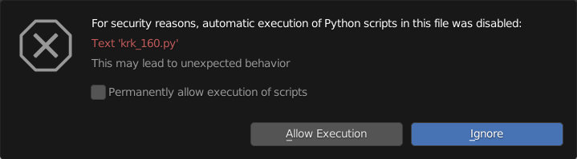

Getting Started
====

What's In The Box
----
In your download section, you'll find a zip file containing a blend file and a txt file as well as SVG's and other assets that are legend template related. Download and extract the zip file into a folder so the contents are together. The txt file acts as a sidecar for Blender's asset management within the blend file.

Getting Started
----
Getting started with KRK2 is as simple as it was in the original KRK. Using Blender (3.1 or later), open the blend file and everything you need to get started is packed in the file. Upon opening the blend file, you will be asked whether to allow or ignore the script that is built into the file. The KRK2 panel requires the script to be running in order to function so choose to allow it here.

The KRK2 UI layout is most similar to Blender's Shading layout with the left column changed from file browser and image editor switched to asset browser and UV editor with an added KRK tab in the sidebar.

Getting Help
----
Join our community:

'Discord <ttps://discord.gg/fVkGTunzT3>'_
