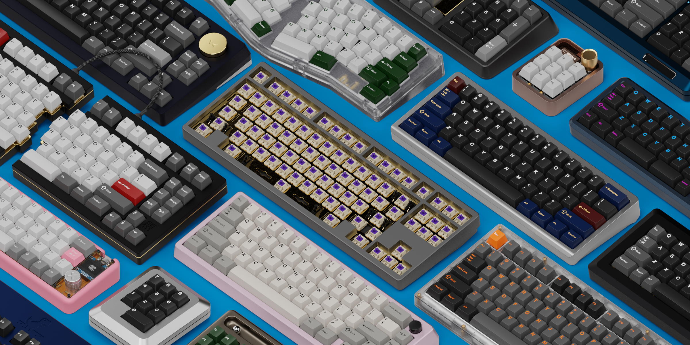

Welcome to Keyboard Render Kit!
===================================

Welcome to Keyboard Render Kit 2 and thank you for your support! 

KRK2 builds on the object data swapping workflow of KRK1 while making everything more flexible, independent and granular. Keycap profiles no longer depend on the geometry of another, boards are portable and everything can be updated independently from one version to another.

|

Requirements
~~~~
**Blender 3.2 or newer**

**Blender Cycles capable machine**

Links
~~~~
`Gumroad <https://imperfectlink.gumroad.com/l/KRK2>`_
|
`BlenderMarket <https://blendermarket.com/products/krk2>`_
|
`Instagram <https://www.instagram.com/keyboardrenderkit/>`_
|
`Discord <https://discord.gg/fVkGTunzT3>`_
|
`Legends Repo <https://github.com/imperfectlink/KRKLegendsRepo>`_

|

.. toctree::
   :maxdepth: 4
   :hidden:
   :caption: Overview

   gettingstarted
   interface
   krkpanel
   assetbrowser
   uveditor
   materials
   outliner
   properties

.. toctree::
   :maxdepth: 4
   :hidden:
   :caption: Materials
   
   capsmat

.. toctree::
   :maxdepth: 4
   :hidden:
   :caption: Creating Legends
   
   leg_inkscape
   leg_illustrator
   leg_designer

.. toctree::
   :maxdepth: 4
   :hidden:
   :caption: Accessories
   
   deskmat
   deskmat_custom
   cables
   mouse

.. toctree::
   :maxdepth: 4
   :hidden:
   :caption: Tutorials
   
   workflow1
   workflow2
   
.. toctree::
   :maxdepth: 4
   :hidden:
   :caption: Further Information
   
   optimization
   krk2max
   krk2c4d
   
.. toctree::
   :maxdepth: 4
   :hidden:
   :caption: Reference
   
   troubleshooting
   recipes
   profiles
   boards
   releases
