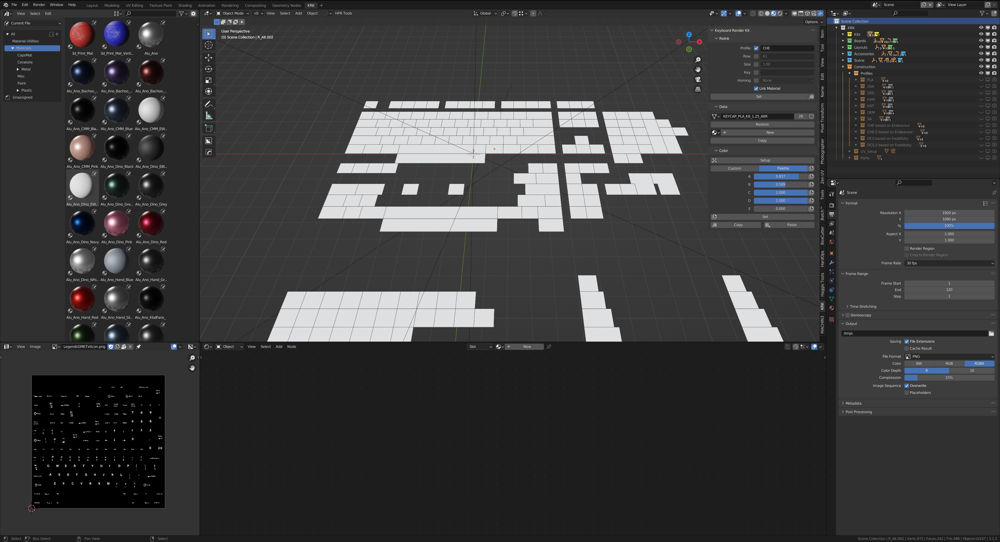
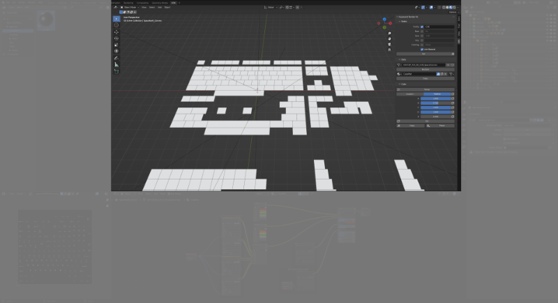
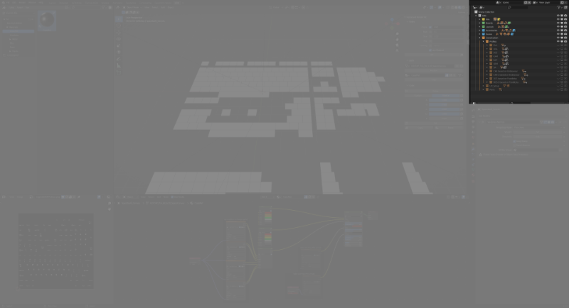

Interface
=====

The KRK2 UI layout is most similar to Blender's Shading layout with the left column changed from file browser and image editor switched to asset browser and UV editor with an added KRK tab in the sidebar.

|

Asset Browser
~~~~
.. image:: img/UI_Asset.png

The Asset Browser is home to many useful materials that are categorized by type and manufacturer.

`Blender manual page on the Asset Browser. <https://docs.blender.org/manual/en/latest/editors/asset_browser.html>`_

|

UV Editor
~~~~
.. image:: img/UI_UV.png

This panel can be used as an image viewer and also show you the coordinates of your legend on the keycap.

`Blender manual page on the UV Editor. <https://docs.blender.org/manual/en/latest/editors/uv/introduction.html>`_

|

3d Viewport
~~~~

This is where you'll be editing your kits, layouts, lighting, camera angles etcetera. It also has the KRK Panel attached to the sidebar where you'll be controlling your keycaps.

`Blender manual page on the 3d Viewport. <https://docs.blender.org/manual/en/latest/editors/3dview/introduction.html>`_

|

Shader Editor
~~~~
.. image:: img/UI_Mats.png

This is where you'll be controlling the look and properties of your materials.

`Blender manual page on the Shader Editor. <https://docs.blender.org/manual/en/latest/editors/shader_editor.html>`_

|

Outliner
~~~~

This panel contains a hierarchy of your blend file. Here you'll find Kits, Boards, Layouts, Accessories, Cameras, Lights, Floors, Profiles etc. as well as visibility options for them.

`Blender manual page on the Outliner. <https://docs.blender.org/manual/en/latest/editors/outliner/introduction.html>`_

|

Properties
~~~~
.. image:: img/UI_Props.png

Most other properties live here in one of the various tabs. 

`Blender manual page on the Property Editor. <https://docs.blender.org/manual/en/latest/editors/properties_editor.html>`_

|
