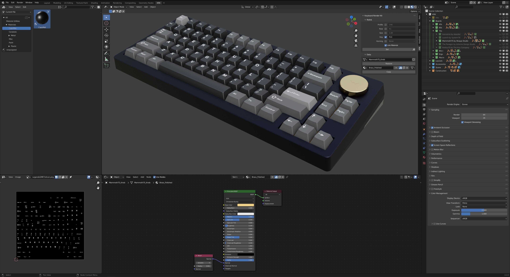
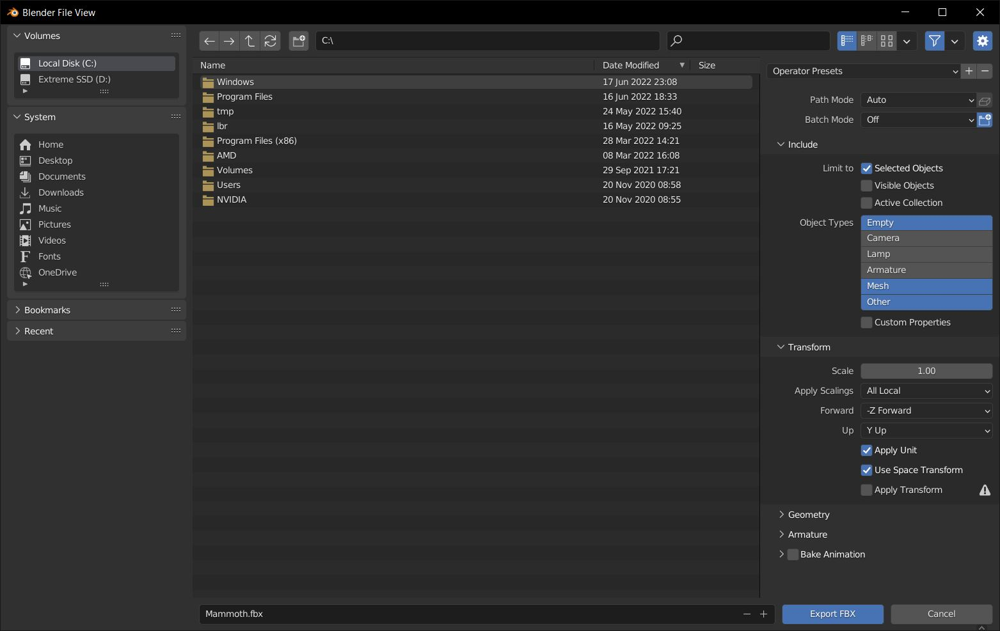

KRK to Cinema 4d
====
Exporting to Cinema 4d is straightforward.

Once your board or kit is ready, hide or turn off all other objects that you don't want to export.

|

Press A on your keyboard to select all.

.. image:: MammothBlenderSelection.jpg

|

Click on File > Export > FBX. Give your file a name and don't forget to make sure that Limit to Selected Objects is checked.

Now in Cinema 4d Import your FBX.
