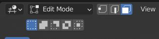
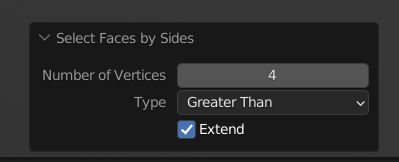

KRK to 3ds Max
====
Exporting to 3d Studio Max is pretty simple. However, there are a couple things we need to do beforehand. 3ds Max doesn't handle ngons as well as well as Blender does but it loves triangles and quads. So let's give it what it wants.

|

Once your board or kit is ready, hide all of the other objects that you don't want to be a part of the export. It's likely that this would include the scene collection so turn that off.

|

Once it is the only thing that is visible, select all by pressing A on your keyboard. Then hit tab to enter edit mode on all of the selected objects.

|

You need to be in face select mode. The shortcut is 3 on your number row.

|

Deselect all by pressing A twice in succession or Alt+A.

|

Now go to Select > Select By Trait > Faces By Sides.

|

Use the popup in the bottom left to set the type to Greater Than.

|

Now all of the Ngons and only the Ngons are selected.

|

Then click on Face > Triangulate Faces or Ctrl+T then press Tab to exit edit mode.

|

Your keyboard is now ready for export. Click on File > Export > FBX. Give your file a name, set the Path Mode to Copy and don't forget to make sure that Limit to Selected Objects is checked.

|

Now in Max, import your fbx.

|
