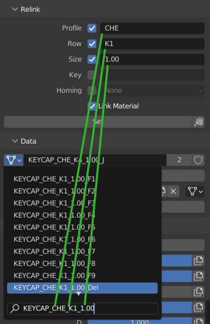
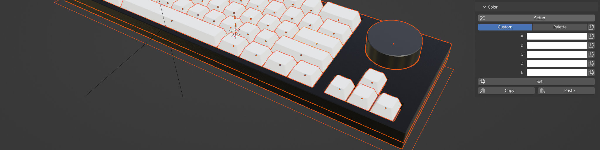

KRK Panel
====

The KRK panel can be found in the sidebar (N) and is is separated into four sections: Relink, Data, Color and Properties. The last two are only visible when the relevant properties are available.

|

Relink
~~~~
Relink is an object data manager designed to quickly swap between keycap profiles, rows, sizes, keys and homing options. Any option that has the checkbox enabled will be taken into account when you press the Set button.

Profile
----

Available profiles and their prefixes are listed in the Profile collection in the outliner while rows and other options you will develop an intuition for. Type the option into the relevant field (case sensitive) with the checkbox enabled and press Set to set the option.

|

Row
----

Due to the fact that different manufacturers and keycap profiles use different row numbering systems, KRK introduces yet another based on the actual position on the keyboard starting from the rear.

|

+--------------+--------+------------------+---------+
| Profile      |Optional| Rows             |Optional |
+==============+========+==================+=========+
| KRK          | 0      | 1-2-3-4-5-6      | 7       |
+--------------+--------+------------------+---------+
| Cherry       | 0      | 1-1-2-3-4-4      | 5       |
+--------------+--------+------------------+---------+
| DCS          | 5      | 1-1-2-3-4-4      |         |
+--------------+--------+------------------+---------+
| DSA          |        | Uniform          |         |
+--------------+--------+------------------+---------+
| DSS          |        | 1-1-2-3-4-3      | 4       |
+--------------+--------+------------------+---------+
| KAM          |        | Uniform          |         |
+--------------+--------+------------------+---------+
| KAT          | 5      | 4-4-3-2-1-1      |         |
+--------------+--------+------------------+---------+
| OEM          |        | 1-1-2-3-4-4      |         |
+--------------+--------+------------------+---------+
| SA           |        | 1-1-2-3-4-3      | 4       |
+--------------+--------+------------------+---------+

Some profiles have an interchangeable first and/or last row.

|

Size
----

You can change the size of a keycap by typing the four character unit size into the field. If the destination geometry is available, it will change to the desired size.

|

Key
----

Type the keycap name into the field to change keycaps over to a different keycap. This is handy for changing to a relegendable (Releg), a blank keycap (Blank) or windowed (*_WIN).

|

Homing
----

You can change the type of homing key between bar/nub/scoop by using this dropdown and clicking Set.

|

Link Material
----
Link Material is an option that allows you to carry over the current applied material to the destination object data. You may want to have this on or off depending on what the desired outcome is. For example, if you were swapping over to the placeholder profile (PLA) you will want the Link Material option turned off so the Capsmat isn't carried over to the placeholders.

|

Copy Settings
----

To the right side of the Set button is the Copy Settings button That helps you copy the object data name into the object data dropdown to aid in searching for a particular key.

|

   The following sections will only display options for the active (highlighted) object.

|

Data
~~~~

Data mirrors the object data and material assignment sections from the properties panel to make them more convenient to access.

|

Easily search through object data to replace the active object data with another. Eg. duplicate or instance a keycap and make the copy into a switch or stabilizer.

|

The Copy button here links the material from the active keycap object to all of the other selected keycaps while ingnoring non-keycap objects.

.. image:: img/MatCopy.gif

|

Color
~~~~

Color is a color and palette management system to help you control the color aspects of your Capsmat. It will only display when there are color properties available. 
If you have a keycap selected that does not hold color properties, the Setup button will be available to apply all the the necessary properties to the keycap object.

|

The Custom/Palette switcher allows you to switch between the custom color and palette workflows. Colors A-E and Palette sliders A-E allow you to control those aspects of the Capsmat on a per object basis through the palette node groups. Choose your options and press Set to propagate them to all of the selected keycap objects or press the individual copy buttons to limit it to one option at a time. Copy and Paste buttons are at the bottom to create and recall an index of options for all of the selected objects.

|

Properties
~~~~

Properties is also only visible when custom properties are available. For the USB cables, it displays the cable options such as braid/techflex and heatshrink color for the heads. If the deskmat is selected, it will display the dimension and edging options instead.

|

