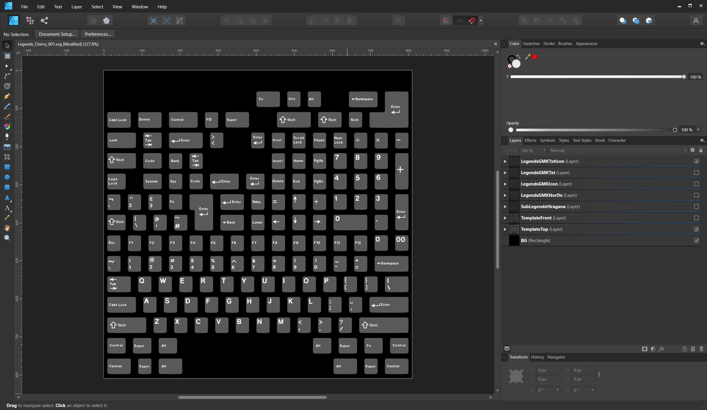
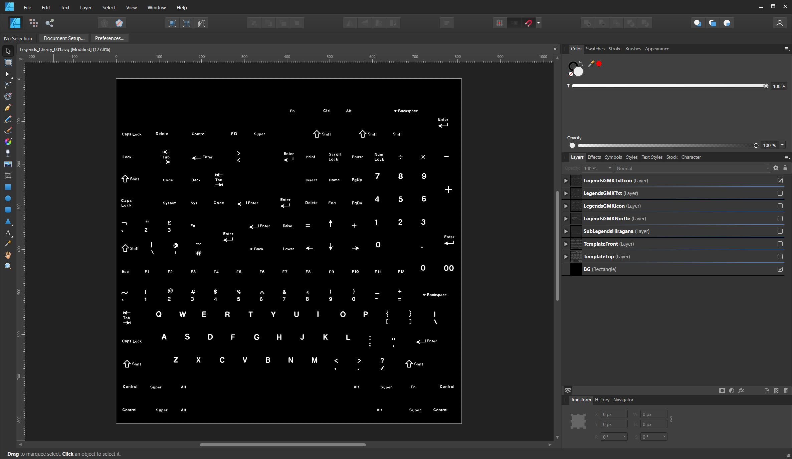
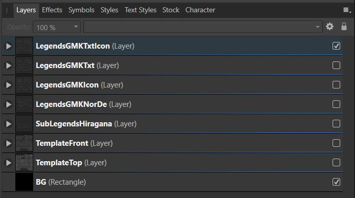
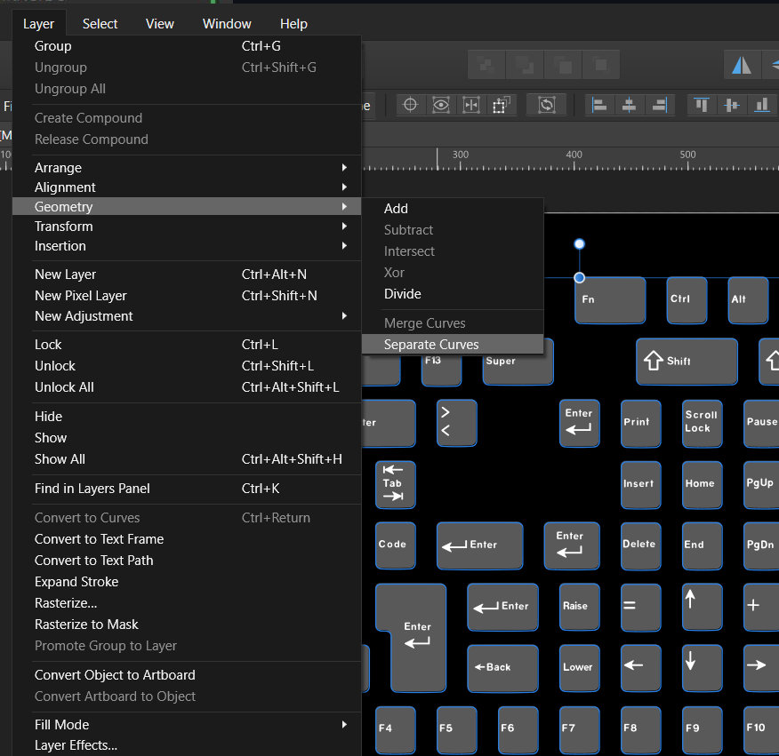
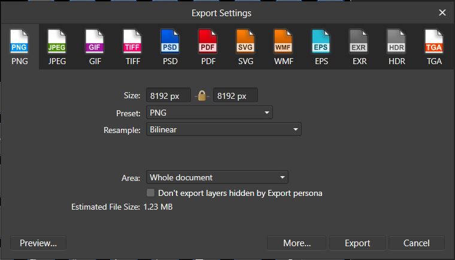

Affinity Designer
~~~~

In the future, each profile will have its own template. KRK1 had one file for all profiles but the newly modeled keycaps have a different UV space so they are now broken out into their own templates as well.

|

Much like Inkscape, upon opening the svg file you will see a layers panel on the right side that contains the legends as well as the templates for the tops and fronts of the keycaps.

|

The template is turned on to help you align your legends and novelties in relation to the touch area of the keycaps. Keep in mind though that the final outcome needs to include a white on black image.

|

Create a new layer and paste your legends into the new layer. You can nudge the legends around using the cursor keys on your keyboard holding Shift for larger steps. 

|

If you would like to use the align tool to align to individual keycaps, the template needs to be broken up into parts. You can do this by selecting it and press Layer > Geometry > Separate Curves.

|

Once you have your legends in place, export with File > Export or Ctrl+Alt+Shift+S. Export your WoB image as a png 4096x4096 resolution or 8192x8192. Really the resolution and filetype don't matter as long as it's a square image.

|

If your novelties or legends are multicolor then turn off the black background and export as an image with transparency. You can use the Alpha channel as the mask and plug the color into the legend color.

|
