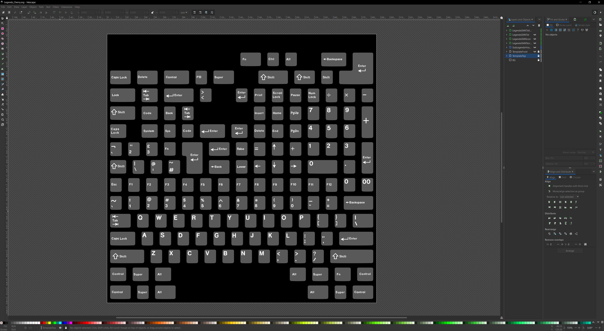
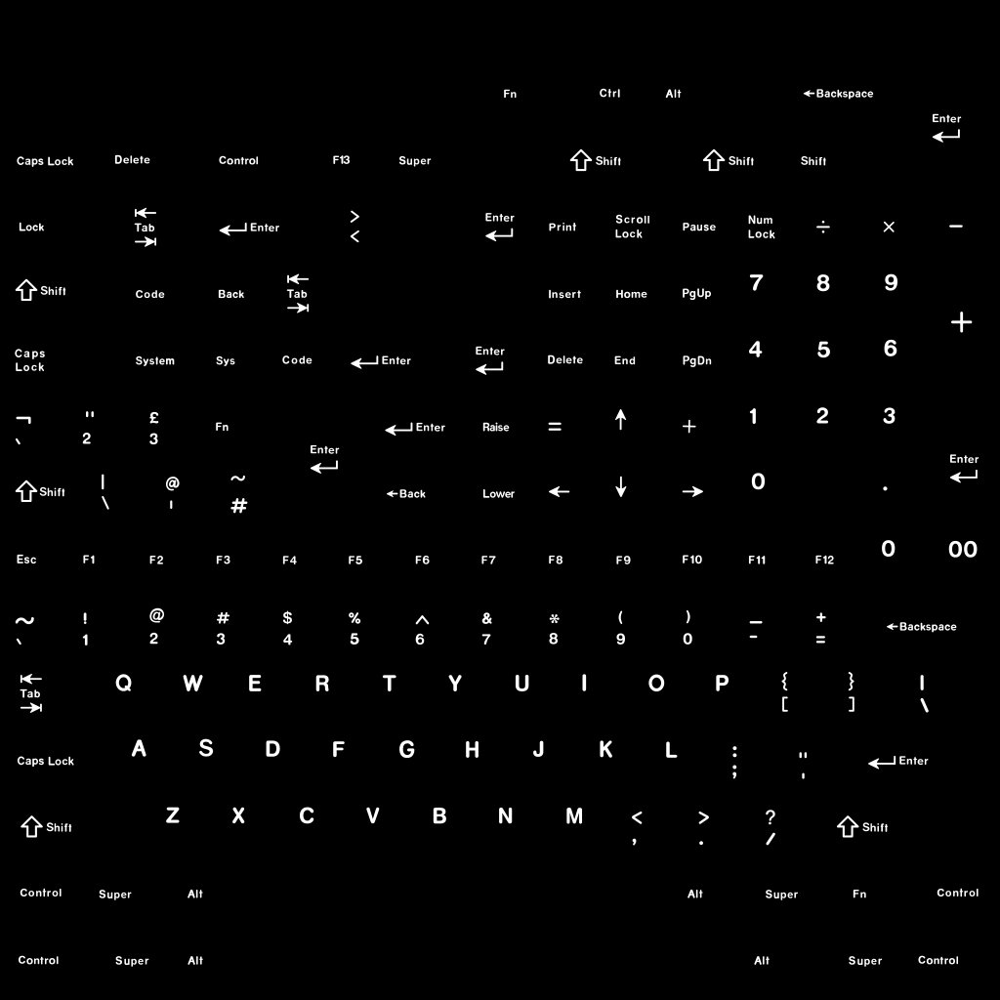
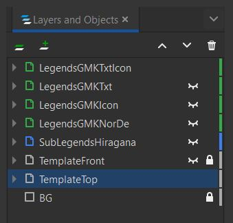
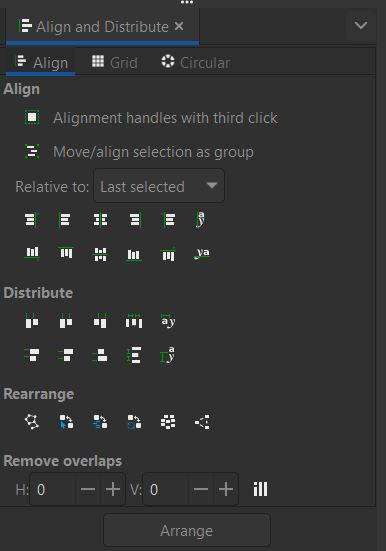

Creating Legends
====
Inkscape
~~~~
The legend files are created in Inkscape which can be downloaded for free here:

`Inkscape <https://inkscape.org/>`_

In the future, each profile will have its own template. KRK1 had one file for all profiles but the newly modeled keycaps have a different UV space so they are now broken out into their own templates as well.

|

Upon opening the svg file you will see a layers panel on the right side that contains the legends as well as the templates for the tops and fronts of the keycaps. If the layers panel isn't visible, you can bring it up by clicking Layer > Layers and Objects or press Shift+Ctrl+L.

The template is turned on to help you align your legends and novelties in relation to the touch area of the keycaps. Keep in mind though that the final outcome needs to include a white on black image.

Create a new layer and paste your legends into the new layer. You can nudge the legends around using the cursor keys on your keyboard. The template layer is locked by default to prevent erroneous selections.

If you would like to use the align tool to align to individual keycaps, the template needs to be broken up into parts. You can do this by selecting it and press Path > Break Apart or Ctrl+Shift+K.

|

Adobe Illustrator
~~~~

|

Affinity Designer
~~~~

|
