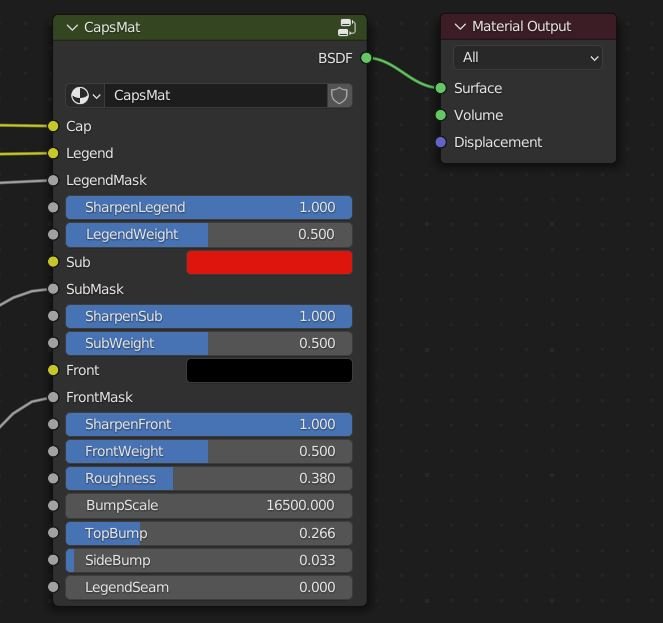
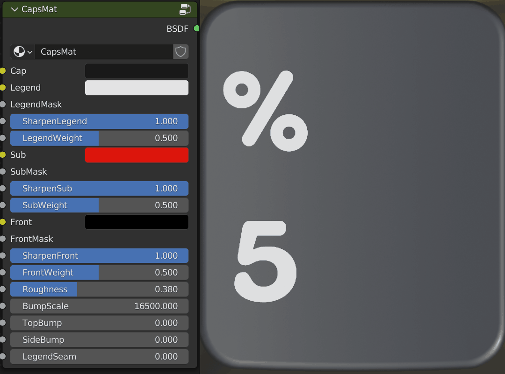
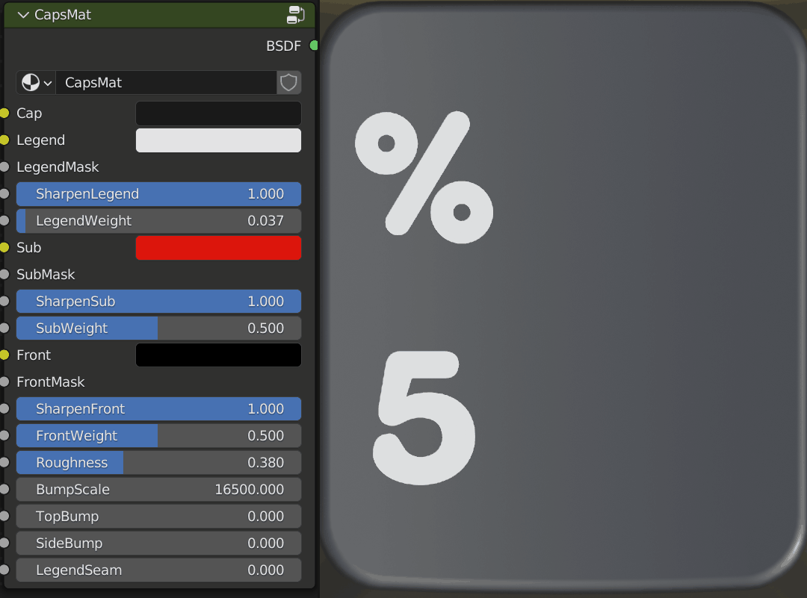
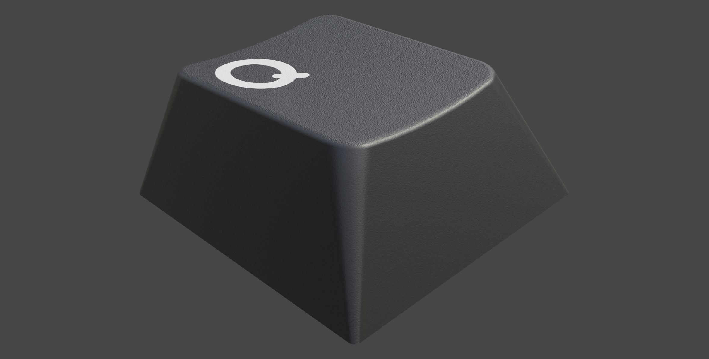
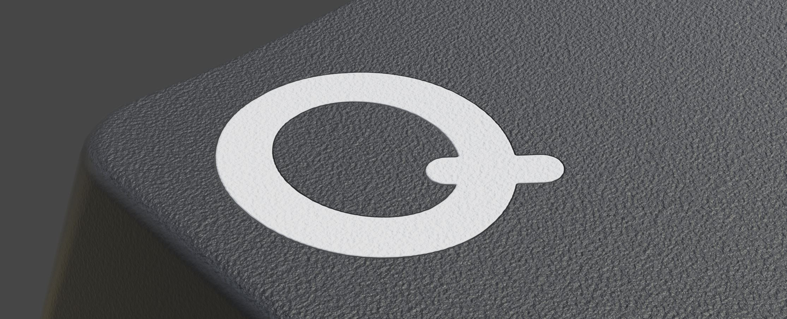

Shader Editor
====
Capsmat
~~~~

Settings
----
Cap
^^^^
This is the base color of the keycap which can be controlled by the color field of by using the socket with a palette.

Legend
^^^^
This is the legend color. You can choose a color, plug in a palette to control the color or even plug an image into the socket for full color legends.

Legend Mask
^^^^
A white on black image is plugged into this socket to mix between the cap color and the legend color.

Sharpen Legend
^^^^

This is used to sharpen the edge of the legend to appear as a doubleshot legend would. This is set to full by default but you can slide it to zero to simulate more of a dye sublimated look.

Legend Weight
^^^^

Due to the way the legend sharpening works, you may also wish to offset the weight to bolden the legend. A smaller number means a bolder legend.

Sub
^^^^
This is the color of the sublegends.

SubMask
^^^^
This is the socket that you can plug in your sublegend files.

Sharpen Sub
^^^^
Like Sharpen Legend, this does the same for sublegends.

Sub Weight
^^^^
Same as Legend Weight but for sublegends.

Front
^^^^
This is the color for the front legends.

Front Mask
^^^^
This is the socket for the front legend mask.

Shapen Front
^^^^
Same as Sharpen Legend but for front legends.

Front Weight
^^^^
This is the same as Legend Weight but for front legends.

Roughness
^^^^
This is the overall roughness or glossiness for the keycap material. This will vary depending on what type of plastic or finish you are aiming for.

Bump Scale
^^^^
This is the scale or grain of the bump noise. Think of it the same as grit for sandpaper in that a larger number represents a higher density.

Top Bump
^^^^

This is the intensity of the bump at the top of the keycap.

Side Bump
^^^^
This is the intensity of the bump at the back, front and sides of the keycap.

Legend Seam
^^^^

Some doubleshot processes result in a more pronounced seam between the legend and the keycap.

|

Masks
----
A mask is a white on black image that defines how to mix two colors or elements together. Consider white to be ON and black to be OFF. In the capsmat, masks are used to mix the cap with the legend, the cap with the sublegend and the cap with the front legend. If any of these are not present, it will assume black or off for that portion. KRK comes with templates to make generating these masks simpler. 

|

Palettes
----

|

Materials
~~~~
Metals
----
Polycarbonate
----

|

Utilities
~~~~

Minor Wear
---- 

Pitting
----

Shimmer
----

|

World
~~~~

|
