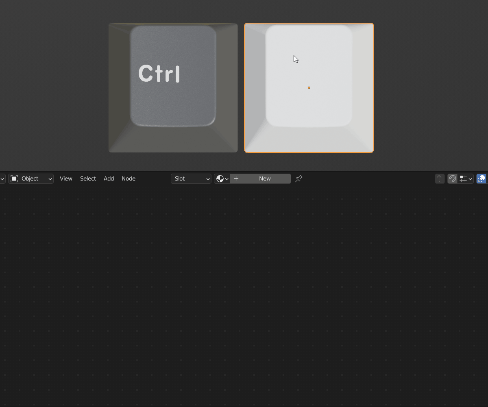
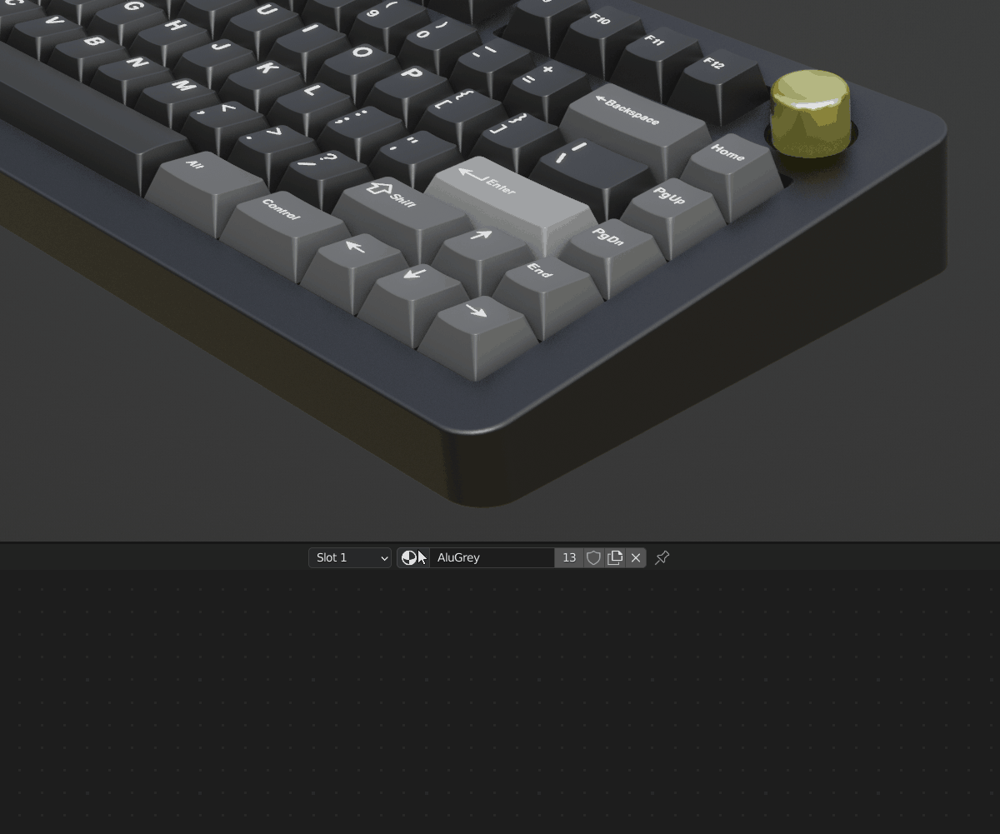
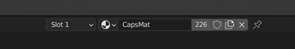
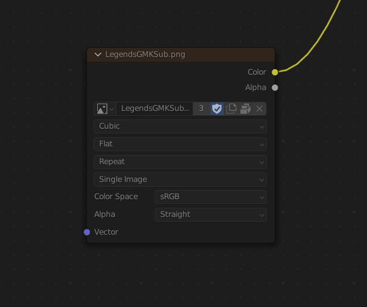
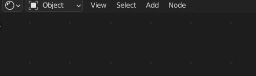

Shader Editor
====
After you select an object, the material that is applied to it will be available to edit in the the material editor. This is only for the active or highlighted object. 

|

The dropdown will allow you to select and apply another material to the object.

|

If you would like to duplicate a material so that it will not affect the material on other objects, you can click the number (which signifies how many objects carry that material) and a duplicate will be made. You can also click the add new material button to the same effect.

|

Image texture nodes require coordinates to know how to use a 2d image on a 3d object. If no coordinates are plugged into the vector input, the active UV will be used.

Some materials contain muted nodes or grey nodes. They are not considered when rendering. To enable these nodes you can select the node by left clicking on it and press M to unmute.

|

The world material is also accessible from the material editor. In the top left, click on the dropdown that currently says Object and choose World.

|
