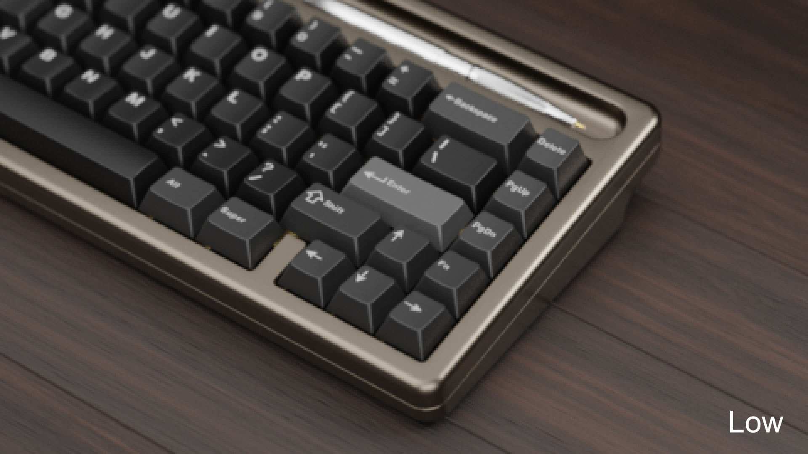
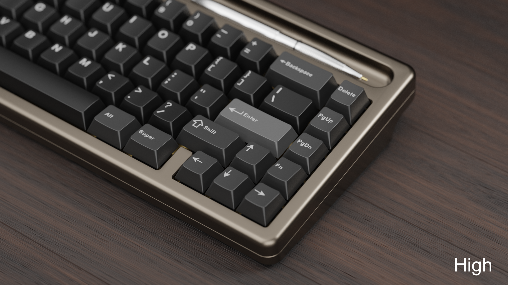
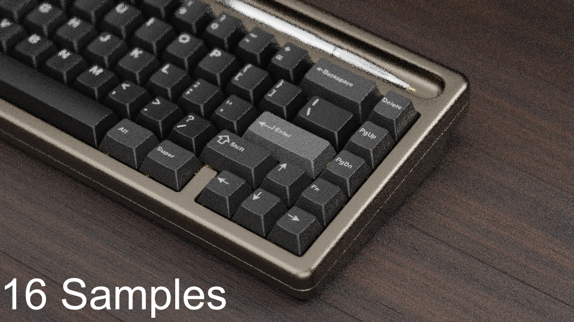
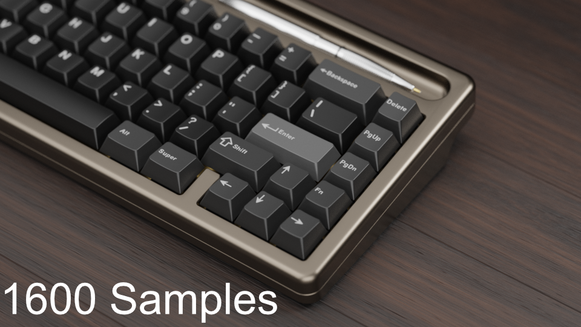
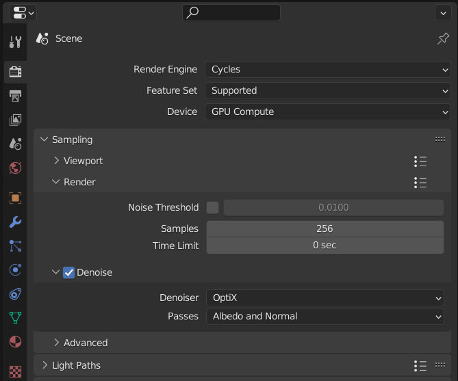
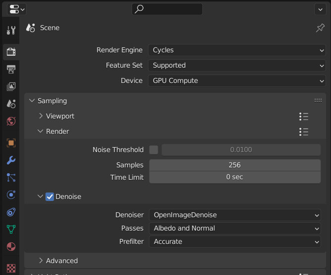
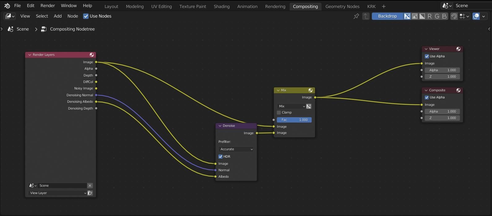
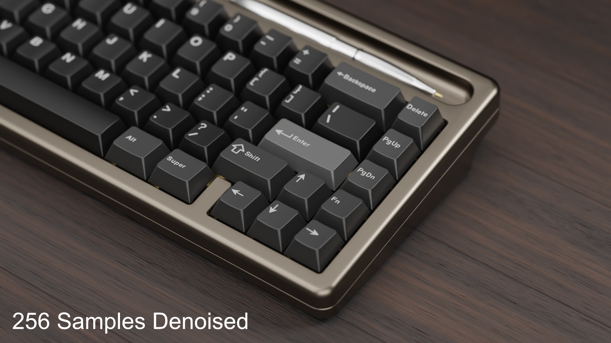

Optimizing Your Render
====
Besides overall scene complexity, there are a few major factors that affect your render time and quality.

|

Resolution
~~~~
Image resolution plays a large part in the amount of time it takes to render an image. Having too low a resolution will manifest as a "pixelated" image. Diagonal lines will appear jagged and fine detail may lack the desired definition.

If for example you increase the fidelity of your image by doubling the resolution from 2k to 4k by setting the percent slider to 200%, your computer now has to process four times the number of pixels. This can lead to much crisper images at the cost of much greater render times.

|

Render Samples
~~~~
The number of samples used is also a key point in optimizing your render. Having too few samples will manifest as a noisy image. Like image resolution, increasing the samples will improve visual fidelity but also increase the render times exponentially.

|

Denoising
~~~~
For as long as digital imaging has existed, so has the need for noise reduction. Whether the source is a digital photograph, a scan, or entirely computer generated, the methods still apply. In more recent times, path traced rendering has pushed development of new algorithms and even the use of machine learning to solve the problem.
Blender has a couple algorithms for denoising so we'll focus on those.

Optix
----

This is a machine learning denoise algorithm from Nvidia. It runs on Nvidia graphics cards from the RTX 20** series onward. As a result of using dedicated tensor cores it is very fast with the caveat of being exclusive to Nvidia users. More information is available here: https://developer.nvidia.com/optix-denoiser

Open Image Denoise
----

This is another machine learning denoise algorithm, this time from intel. As the name suggests, it is open and will run on a variety of cpu models and architectures. It is not as fast as using Optix but it is very good at what it does and has the edge in scenes that include some form of transparency. For example in rendering polycarbonate keyboards. More information about Open Image Denoise is available here: https://www.openimagedenoise.org/

Application
----

Both of these algorithms can be used in the viewport and final render by enabling them in the options. However, OID is faster when used in the compositor. In KRK the compositor set up is already created and all that is left to do is to enable nodes using the checkbox on the top left of the compositor panel. 

|

For more information on denoising, visit the `Blender manual page on denoising. <https://docs.blender.org/manual/en/latest/render/cycles/optimizations/reducing_noise.html>`_

|
