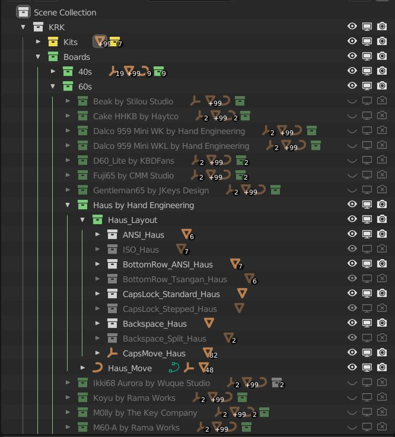

Outliner
====
The outliner holds all of the items in your scene organized into collections.

Kits
~~~~
The Kits collection is turned on by default

Boards
~~~~

Boards are organized by size and then alphabetical. Use the triangle to dig into the subcollections and then into the board's layout options such as stepped capslock or Tsangan bottom row.

Layouts
~~~~
These are extra layouts that you can use to populate a custom board that you've imported. Right click on the layout and duplicate linked to create a linked collection then move it to your board's collection.

Accessories
~~~~
The available accessories are listed here and include a deskmat model, a mouse, USB cables and a wrist rest.

Scene
~~~~
This is where you'll be accessing your scene elements such as lights cameras and backdrops.

Cameras
----
Cameras have been pared down in KRK2 but you can duplicate them to set your own angles etc.

Lights
----
Various light setups have been created to help decide on a general look for your scene. They are based on popular studio lighting HDRI setups but offer more freedom and adjustment. Feel free to adjust the intensities and positioning of these lights.

Floors
----
A set of interesting floors come with KRK to get you started. This includes a ShadowCatcher floor that is based on FloorLightGrey but captures the shadow for transparent background renders.

Construction
~~~~

Profiles
----
All of the keycap profiles live here.

UV Setup
----
This collection contains all that is needed to do UV projections for the keycaps.

Parts
----
This collection contains the extra parts that you can object data swap to add elements to your boards.
