Poly Haven Assets
====

Okay, you've set up your board, and added your keycap profile and colourway. The camera is framing the subject nicely, but the lighting and floor are just not what you want.

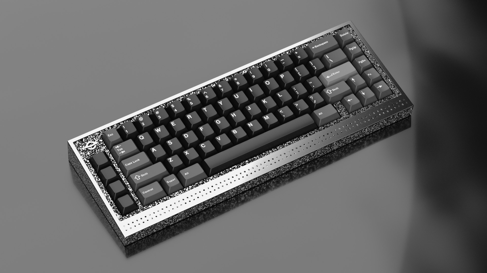

|

KRK comes preloaded with various floors and light setups to get you started, but you may wish to try alternative floors and lighting to add more variety. Polyhaven is a great resource for surfaces to render your boards on as well as HDRIs (High Dynamic Range Image) to light your scene. Let's go through the process of loading them in.

|

Much of this process can be skipped if you own the Poly Haven addon. If you find yourself doing this often, I highly recommend it.

|

Floor
~~~~

First visit the Poly Haven site (polyhaven.com) and click on Assets>Textures in the top bar. 

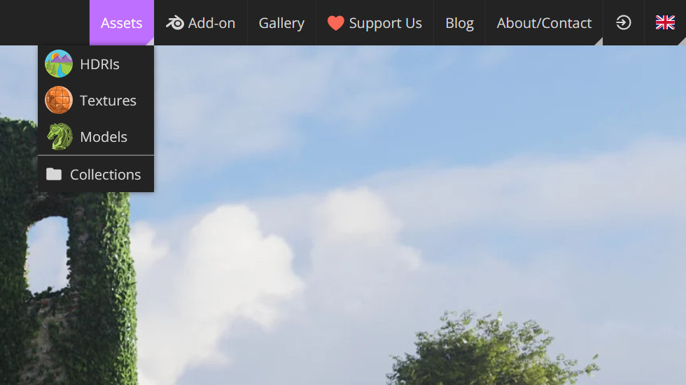

|

There are several categories to choose from. For this example click on the Floor>Indoor>Man-Made category and choose Slab Tiles.

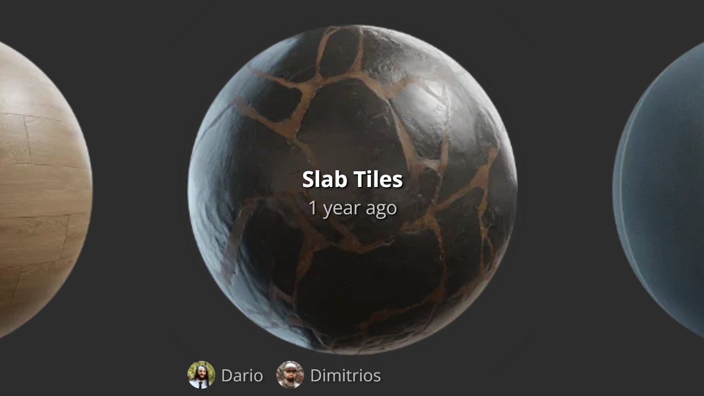

|

Click on the download button and allow the zip file to download. Browse to the download location and extract the zip file to it's respective folder. You'll notice that there is a blend file in the folder. This means that there is already an object in there that is already set up for use.

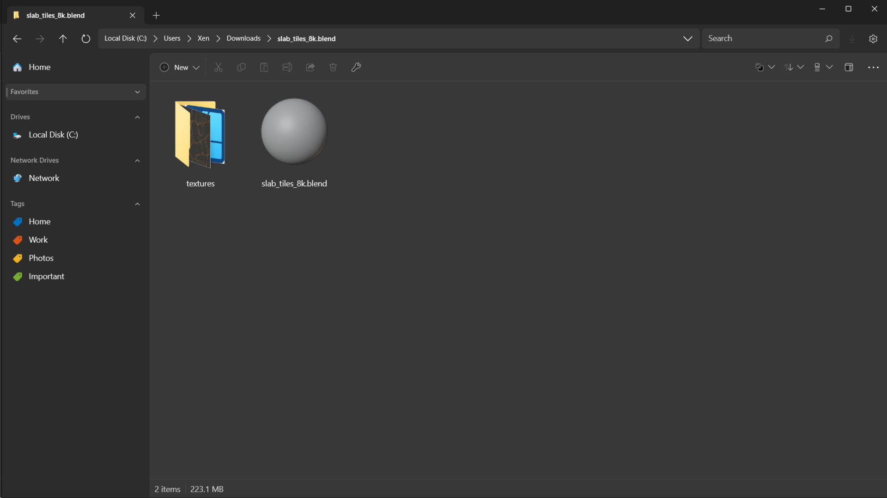

|
  
In order to import Blend file contents, you need to use the Append or Link function to bring it in. For this process, we'll append the floor and not maintain a link to the original. In Blender, click on File>Append to initiate the import of the Poly Haven floor. From here, choose the Object subcategory and find the floor which is likely named "Plane". 

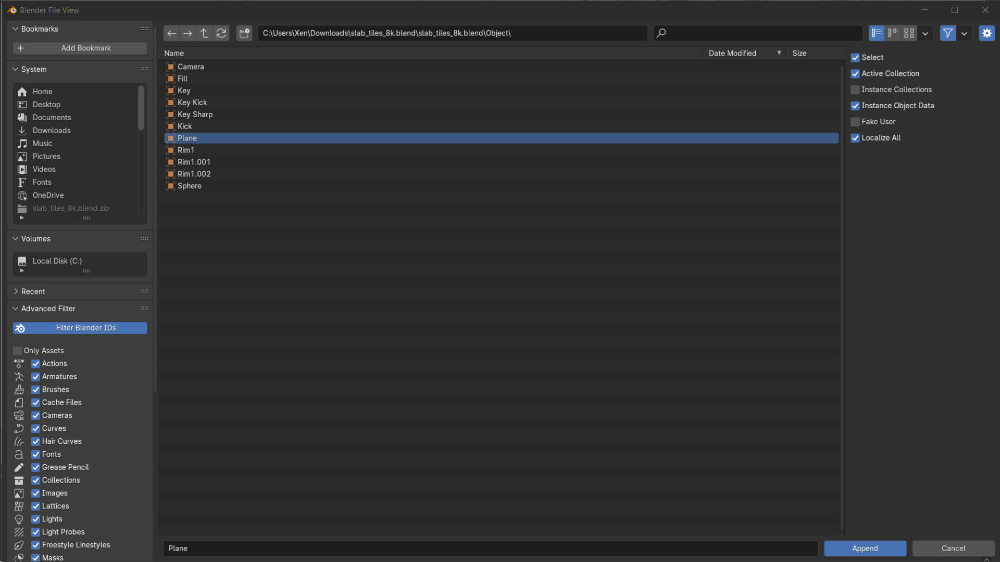

|

It will append into whichever collection you have active in the outliner. With the floor in your scene, you can now make changes to it.

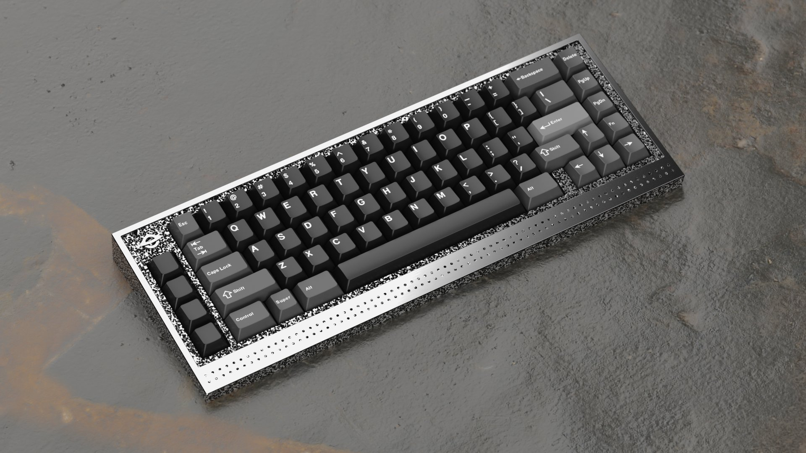

|

By default, there is not enough geometry for the displacement to push and the scale of the texture feels too large for the context. Change that by plugging a Value node into the scale and set that to 2 to double the scale. Based on my camera angle, I also used the mapping node to move the texture 80mm. In the modifier tab, find the subdivision modifier and change the subdivision level to 10 in order to have more geometry to support the detail of the displacement image.

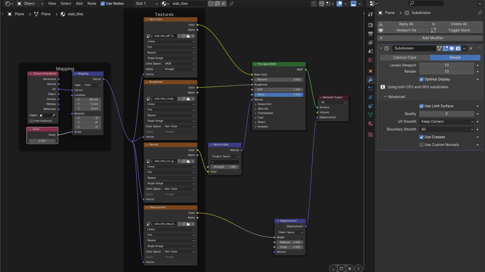

|

Since there is a displacement, It is also a good idea to move the floor object down. This one has been moved 7mm. The floor is now ready for rendering.

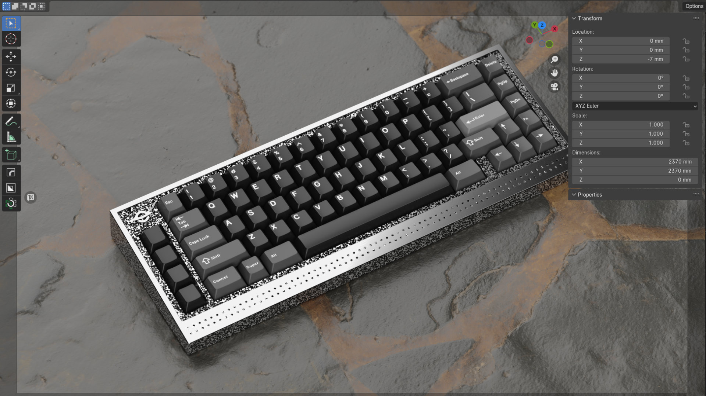

|

Environment
~~~~

Keep in mind that while HDRI lighting adds a degree of realism, it also affects colour, which is fine for board and scene renders but not for kit renders where colour accuracy is critical. To add one in, go to Poly Haven and click on Assets>HDRIs and choose one to download. In this example, we're using Leadenhall Market which downloads as an EXR image file.

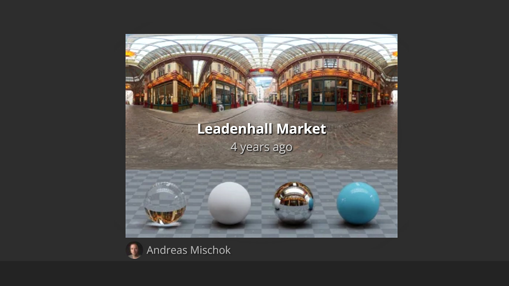

|

Disable the Lights collection in the Outliner.

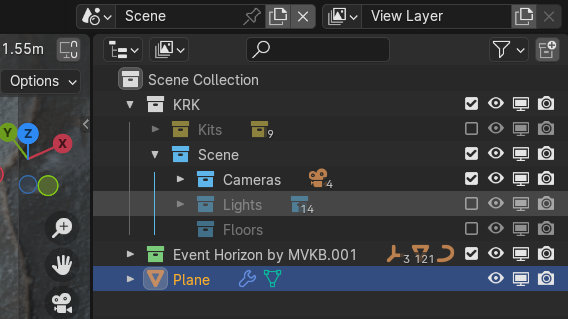

|

Then in the Material Editor, click on the dropdown in the top left and switch it from Object to World. There is already a world set up. Unmute the image node by selecting it and pressing M, then click on Open to load in the Leadenhall Market image.

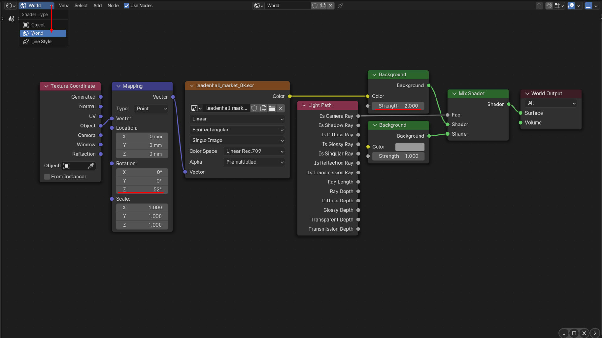

|

You may wish to manipulate the image so create a Mapping node and Texture Coordinate and connect it as seen in the image. Here I've rotated the image 52 degrees to find an interesting highlight on the right edge of the board and also doubled the intensity of the HDRI.

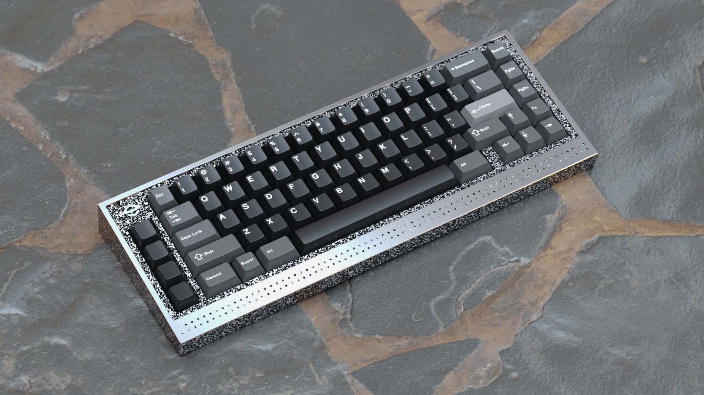

