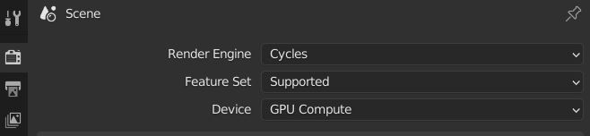
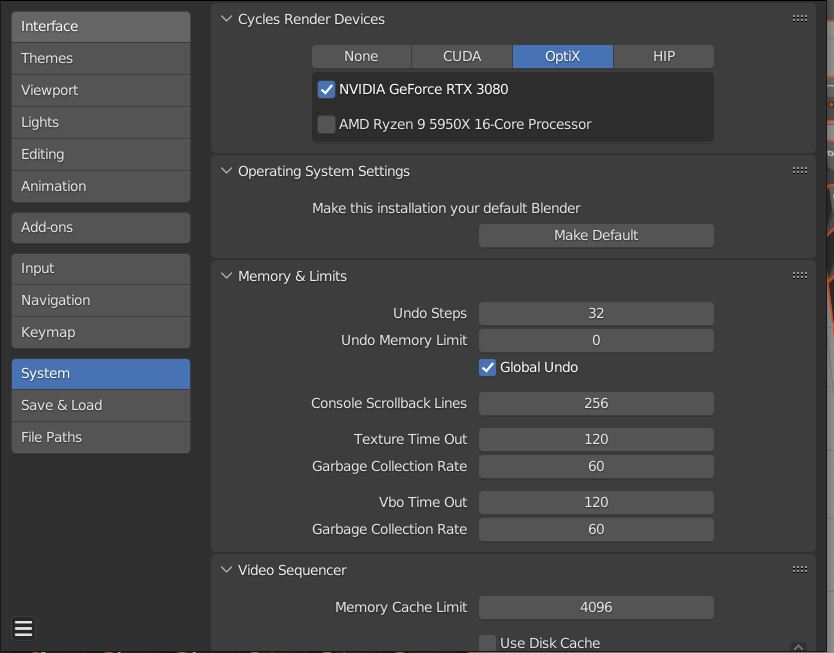
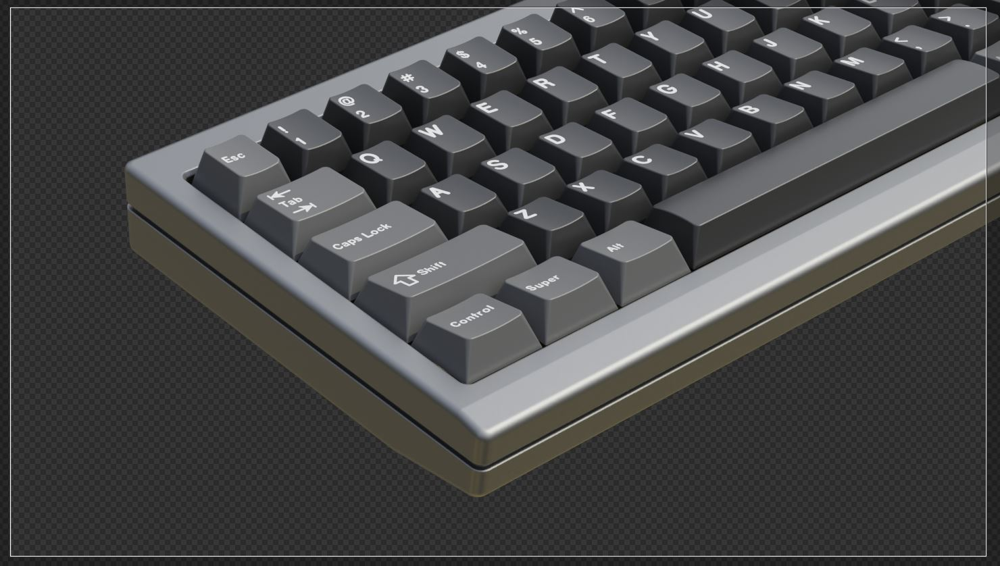
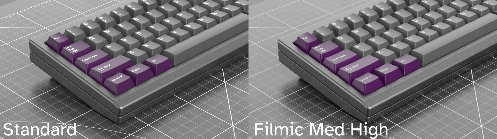
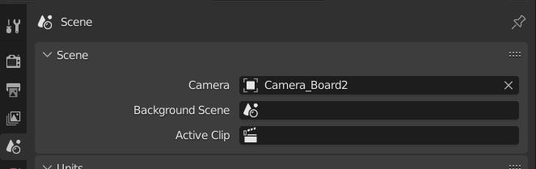
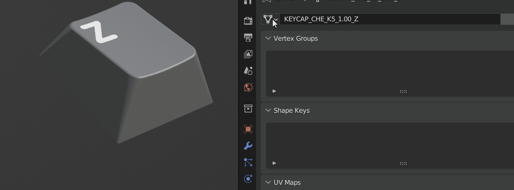
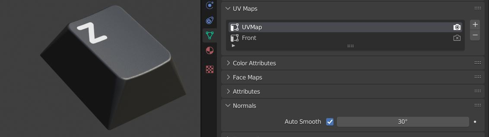
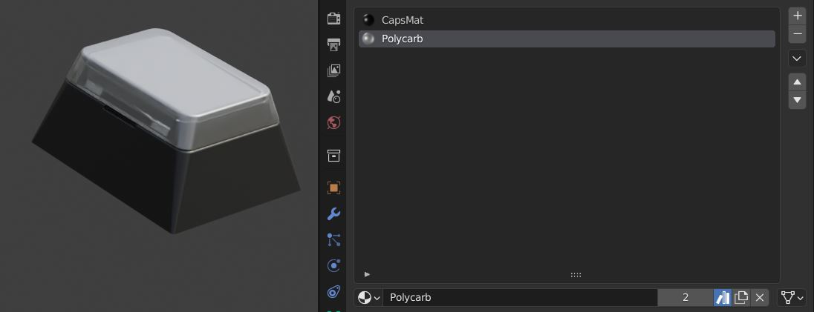
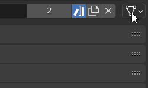

Property Editor
====

The properties section of the Blender UI is massive so I'm only going to call out a few of the most pertinent areas.

|

Render Properties
~~~~
Render Device
----

You may choose to accelerate your render by utilitizing the GPU (graphics card). Keep in mind you also need to set up the compute device in the preferences for this to work.

Sampling
----
Default sampling is set to 32 in the viewport and 256 at render time. If you are rendering polycarbonate, I highly recommend you choose at least 512 samples.

Denoise
----
Denoising can be set here. I usually check the denoise on for viewport and set it to automatic. Set the start sample to 2 or more to keep your viewport responsive. Denoising for final render is also available in the compositor.

Film Transparent
----

If you are rendering transparent background images, you need to turn on Film>Transparent.

Color Management
----

This is an important section. Blender's default setting for color management is Filmic which I have left here with no look applied. Some users prefer to set this to Standard because it feels as though it is easier to color match. I generally prefer Filmic because of the light rolloff and set to a Medium High Contrast to get a very similar feel to Standard but with better shading. If you plan to export to EXR, the choice you make doesn't matter. It will just export the full buffer.

|

Output Properties
~~~~
Resolution
----

This is where you set the resolution of the output image. This resolution also matters when you are doing UV related things such as projections. 

|

   Tip: If you want to set 4k when it is currently at 2k resolution, you can type a 200% in the field instead of 100%.

|

Scene Properties
~~~~
Active Camera
----

This is where you set the active camera that Blender will use when you press render.

|

Object Data Properties
~~~~
Object Data
----

Don't skip over the Object Data dropdown as it allows you to turn any object into any other object by choosing it from the dropdown.

UV Maps
----

If you need to access an object's UV map, this is where you'll find it.

|

Material Properties
~~~~
Material Index
----

Objects can have more than one material attached to them. Eg. the windowed and relegendable keycaps have 2 material slots for the keycap material and the polycarbonate.

Material Link
----

You can tell Blender whether to use the material attached to the object data or the object on a per object basis.

|
