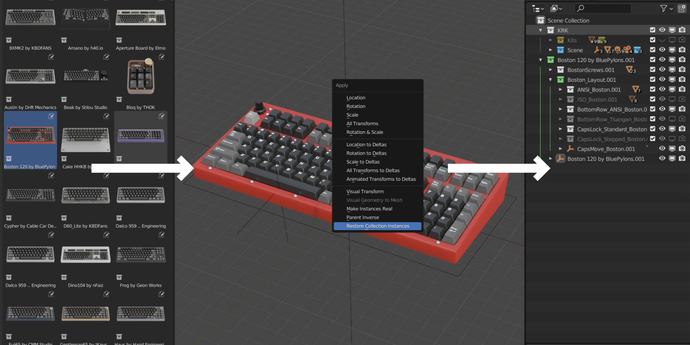
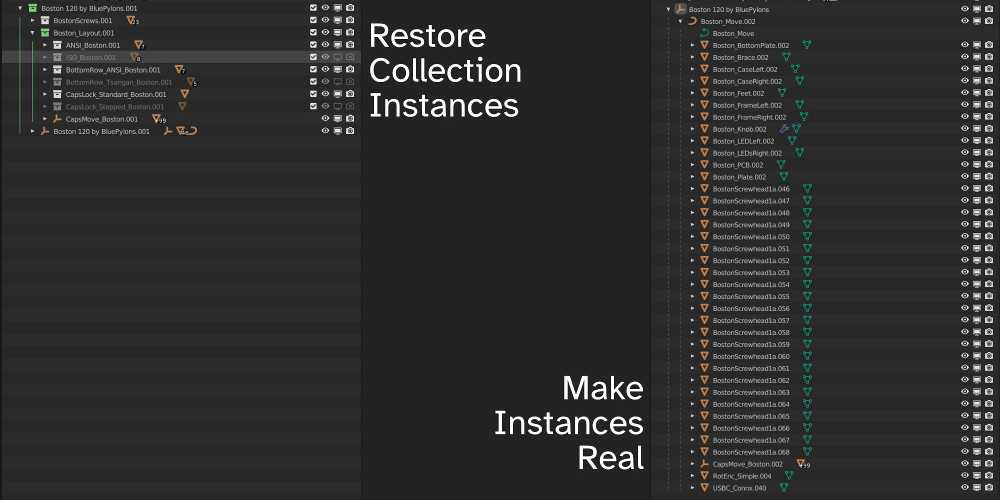
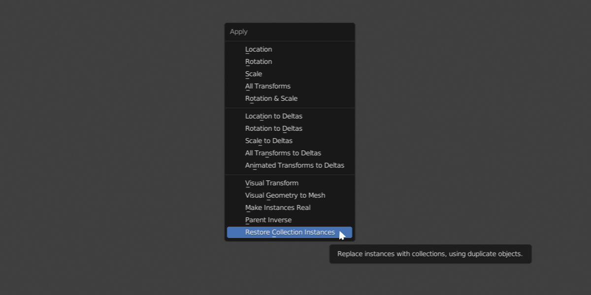

Restore Collection Instances
====

Restore Collection Instances is a simple addon developed to fill a gap in Blender functionality where collection assets do not restore properly with Blender's default "Make Instances Real" function. Blender does not maintain the original collection hierarchy even though parent hierarchy can be maintained.

|

Compare results of Make Instances Real with the maintain hierarchy option turned on vs. Restore Collection Instances. 

In this example, the original collection asset had 176 objects in it with some visibility options turned off. The Make Instances Real function only brought back 161 of them and lost all of the collections, organization and colour.

|

|

Although Restore Collection Instances was originally developed as a part of Keyboard Render Kit, we quickly realized that this would be useful as a general purpose tool.

|

|

To use the tool, simply press ctrl+A and find it in the apply menu.

