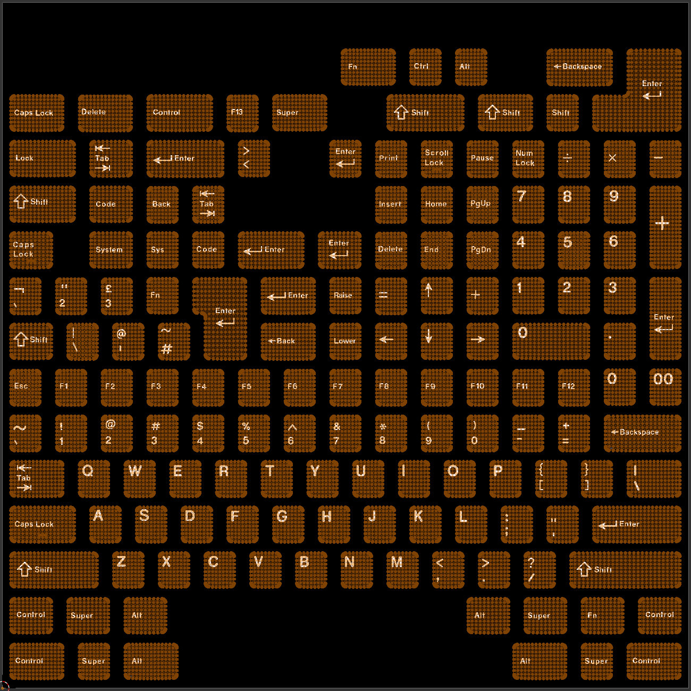

UV Editor
~~~~
The UV editor is a combination image viewer and UV coordinate editor. This will give you an idea how the 2d image will behave as a legend in 3d space.

For further information on UV coordinates in Blender, `read the Blender manual page on UVs. <https://docs.blender.org/manual/en/latest/editors/uv/introduction.html#uvs-explained>`_
