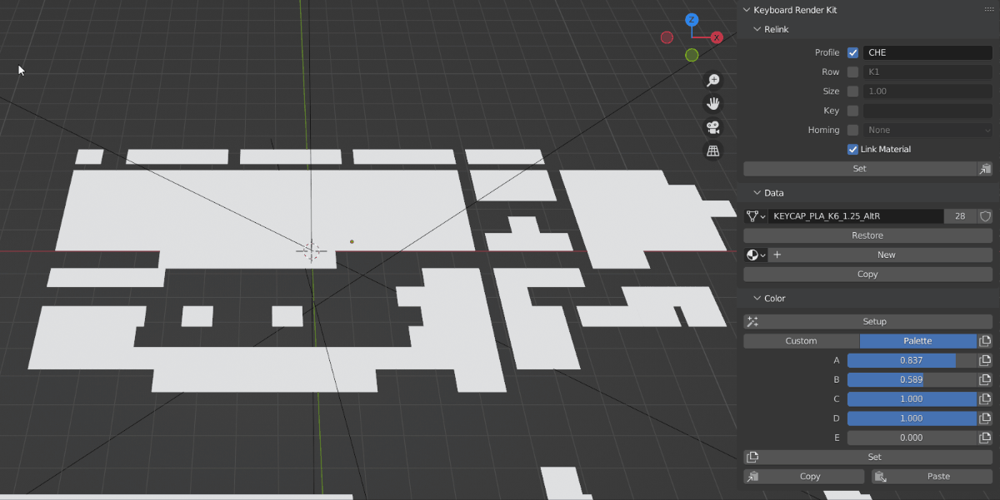
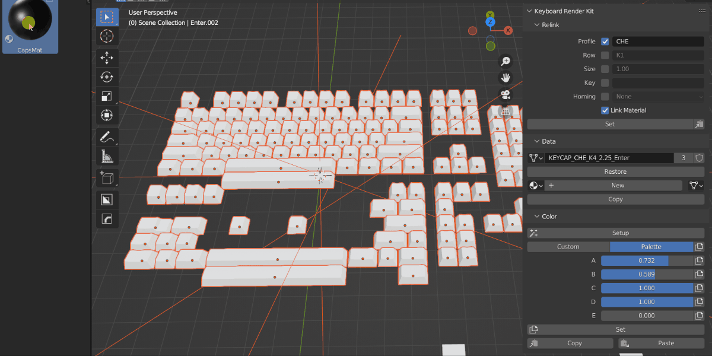
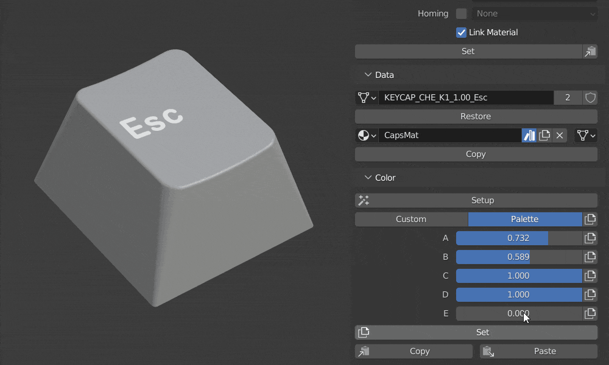
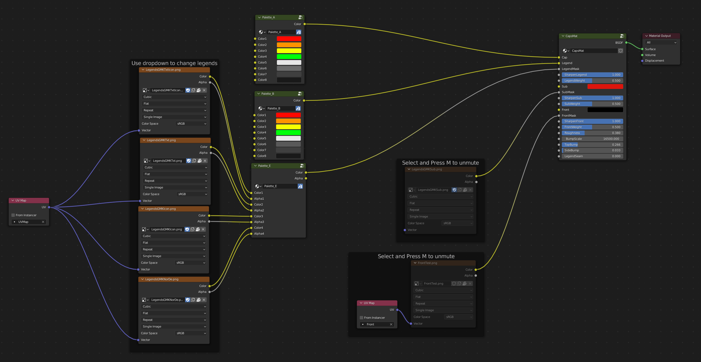
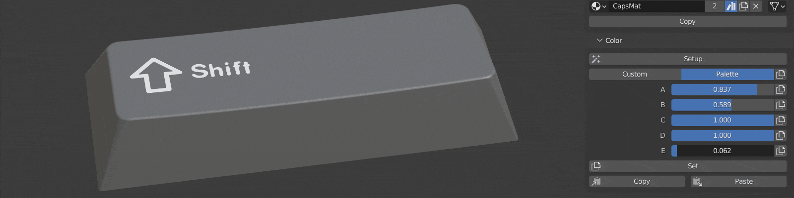
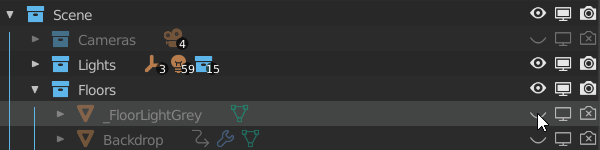
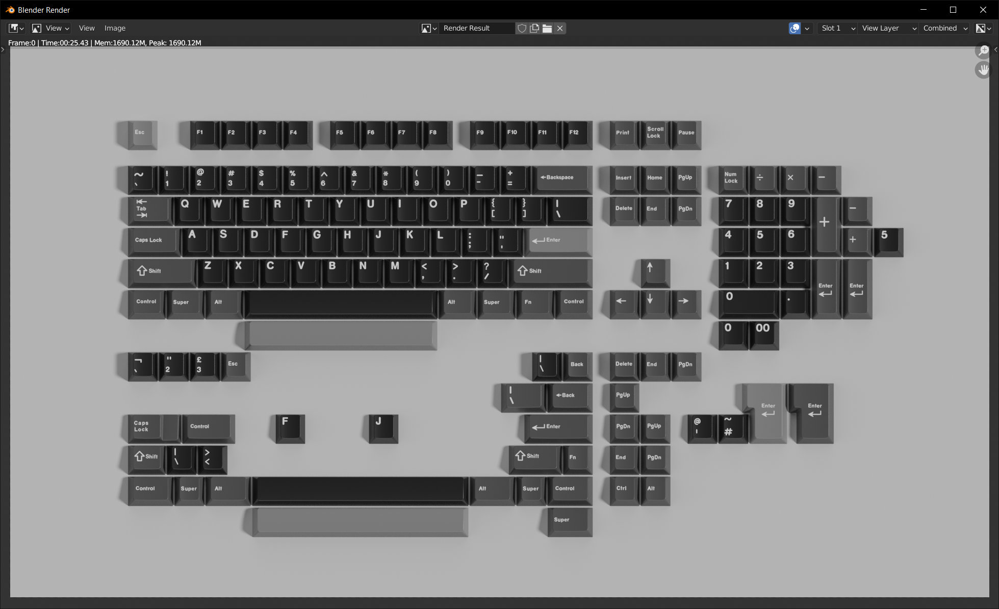

Your First Kit Render
====

The first thing you'll notice when you get started is that there are no keycaps. Instead there are many planes in the viewport. These are placeholders that can be replaced with keycaps.

Select the placeholders by dragging a box selection and then press the Set button in the Relink section of the KRK panel. The relink process ignores all but the keycap objects and you should now have Cherry profile keycaps. Relink will also ignore keycaps that don't have destination object data. Profile prefixes can be found in the Profile collection.

Drag the Capsmat from the Asset Browser onto one of the keycaps. With that keycap as the active object (highlighted), you can link the material to the other keycaps with control+L then material or just press the Copy button in the Data section of the KRK panel.

The palette system is designed to facilitate color exploration. You can start off with custom colors on a per object basis and then later take a more rigid approach using defined palettes in the material editor.

The palettes are general purpose node groups but by default they are set to:

A: Cap color

B: Legend color

C: Sublegend color (not applied)

D: Front legend color (not applied)

E: Legend masks

Test out the sliders on a keycap and flip over to custom to set your own custom colors. Once you have something you like, you can set it to all of the other keycaps by hitting the Set button in the Color section with that keycap selected last.

Keycap colors are now able to be stored on the object rather than just is the material. You can still use the traditional workflow if you prefer and remove the palettes from the material.

Use the slider for Palette E to change the legend of a modifier key between Text, Icon or Text+Icon. 

Add a floor by turning on the visibility options for FloorLightGrey in the Outliner. It can be found as the first item in Scene>Floors.

Click on Render>Render Image or press F12 to render your first image.

You've just completed example workflow tutorial 1.

Bonus points:
Change the camera to Camera_Kit_Tilted in the scene properties.
