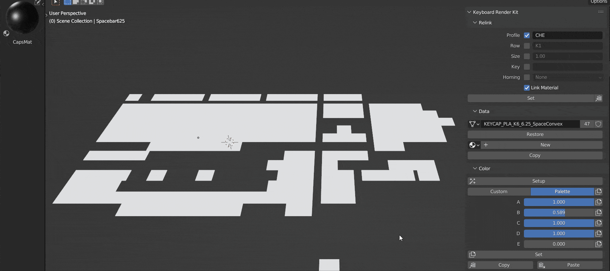
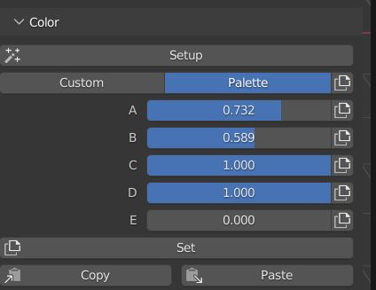
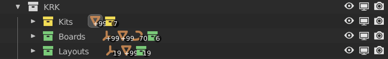
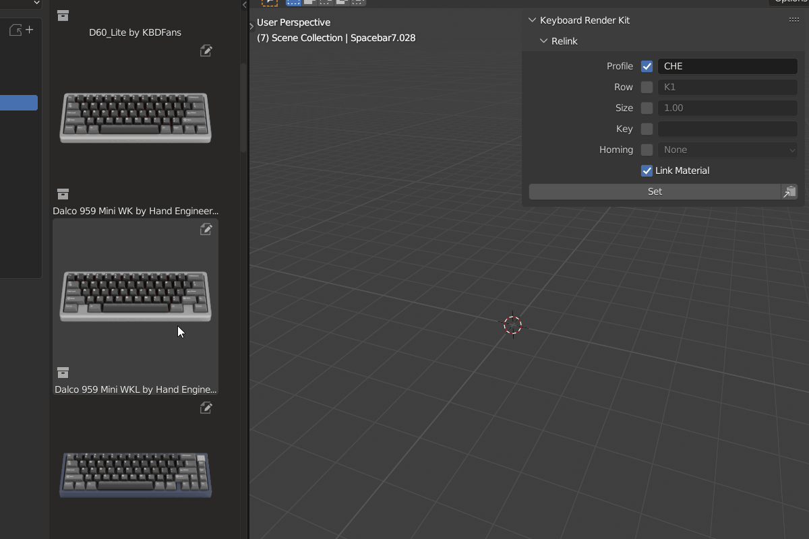
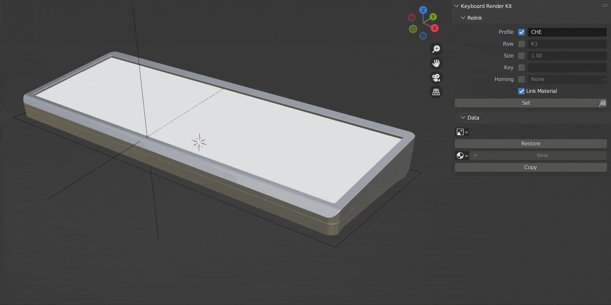
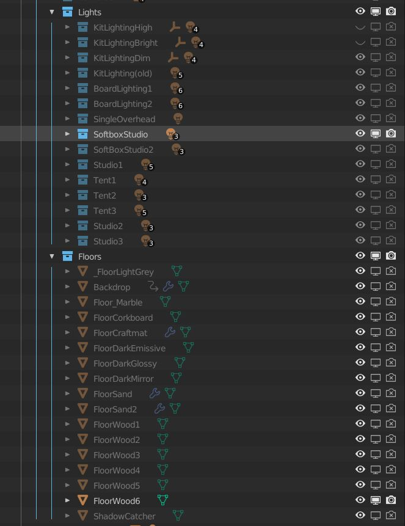
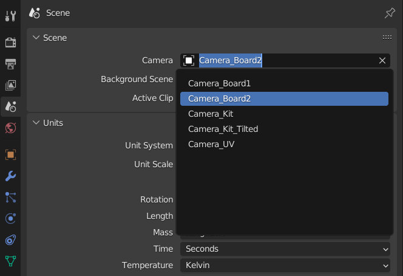
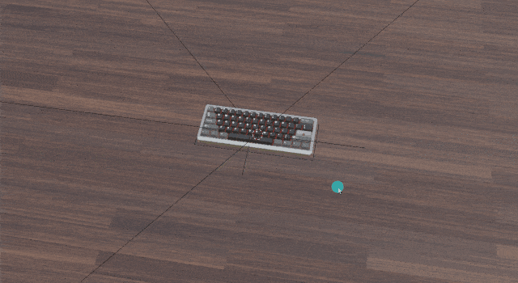
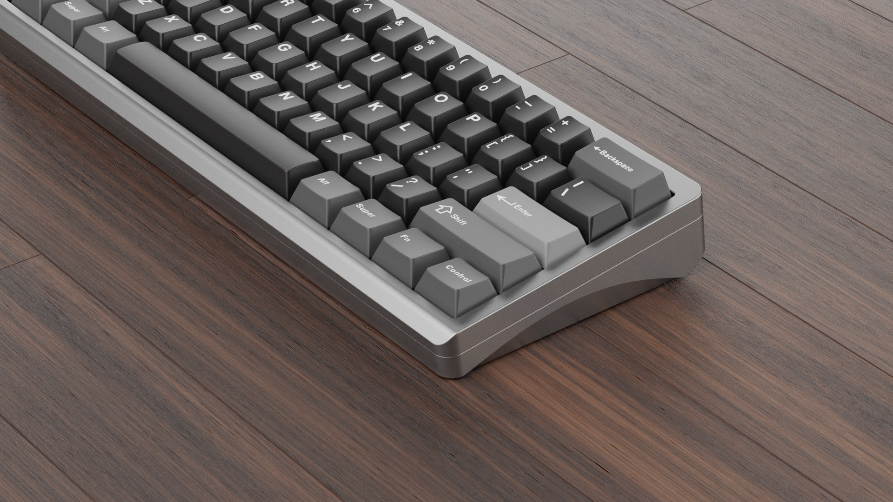

Your First Board Render
====
Now that you know the basics, let's render a keyboard. We'll expand on what we learned in the first tutorial.

|

In a fresh KRK2 file, press A in the viewport to select all and then press the Set button in the Relink section of the KRK panel to set them to Cherry profile.
Drag the Capsmat from the asset browser onto one of the keycaps. Shift click the same keycap to make it the active object and press the Copy button in the Data section of the KRK panel.

|

Now click on Copy in the Color section of the KRK panel. This stores the color information to be recalled later.

|

Now hide the Kits collection using the visibility options in the Outliner.

|

Drag the Dalco 959 Mini WKL board out of the Asset Browser and reset its position by pressing Alt+G, then press the Restore Collections button to make it editable.

Select one of the placeholders on the 959 Mini and then box select over all of them and press Set in the Relink section of the KRK panel.

Click Setup in the Color section and then press the Paste button in the Color section. This recalls the colours that were stored from the kit.

|

Let's setup a scene.

|

Delve into the Scene collection into Lights, turn off the visibility options for KitLightingHigh and turn on SoftBoxStudio.
Turn on FloorWood6 in the Floors collection.

|

In Scene Properties, set the camera to Camera_Board2.

|

Rotate the viewport to an interesting angle and set the active camera to view by clicking View > Align View > Align Active Camera To View (Ctrl+Shift+Numpad0).

|

Now render your scene.

|

This completes example workflow tutorial 2.

|
